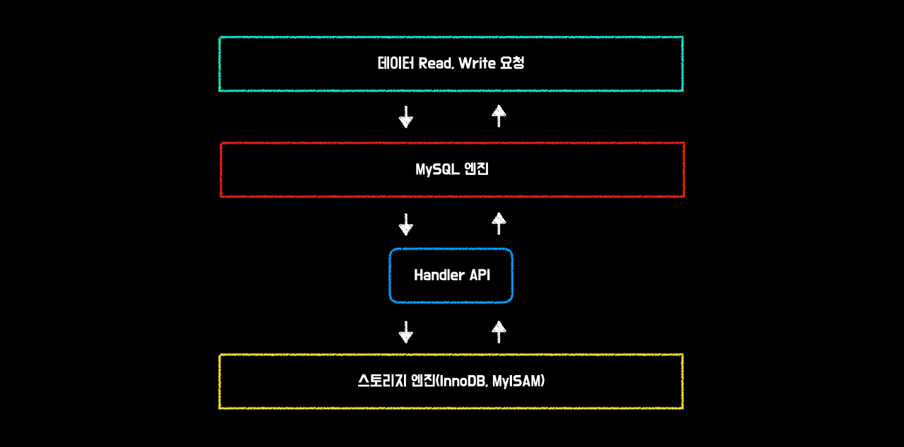
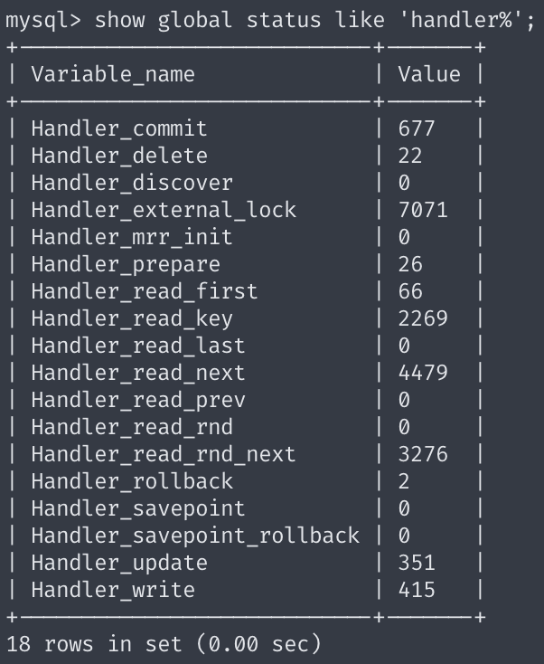
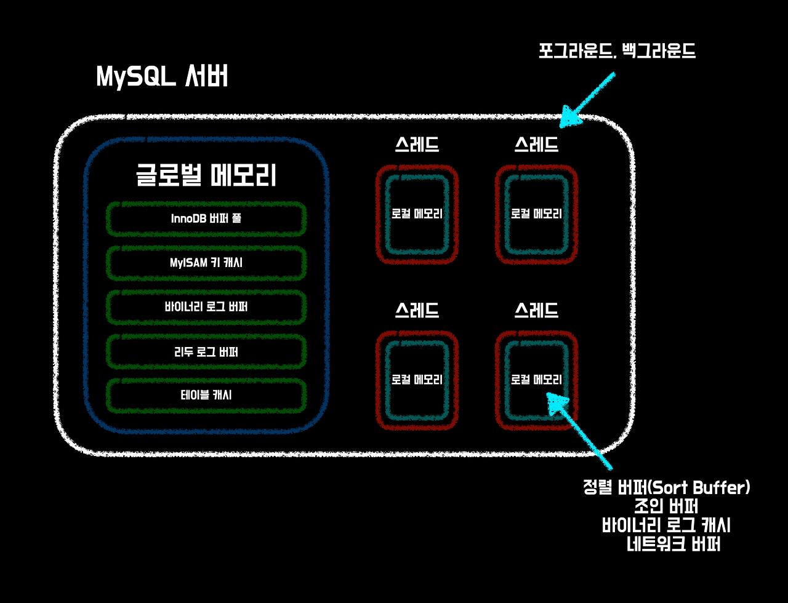

# MySQL 엔진 아키텍쳐
MySQL 서버는 다른 DBMS에 비해서 구조가 독특하다. 그 이유가 무엇일까? MySQL 엔진 아키텍처가 다른 DBMS에 비해 독특한 이유는 아래와 같다.

* **다중 스레드 아키텍처를 사용한다.** 이는 데이터베이스 서버가 여러 개의 작업을 동시에 수행할 수 있도록 하며, 따라서 처리 속도를 향상시킨다. 
* **InnoDB와 같은 트랜잭션 지원 스토리지 엔진을 사용한다.** 이를 통해 MySQL은 데이터 무결성을 보장하고 트랜잭션 처리를 위한 기능을 제공한다. 
* **여러 개의 스토리지 엔진을 지원한다.** 이는 사용자가 자신의 요구 사항에 맞는 스토리지 엔진을 선택할 수 있도록 하여 유연성을 제공한다. 
* **고성능 데이터베이스 시스템을 구축할 수 있는 많은 옵션과 기능을 제공한다.** 이는 데이터베이스 관리자가 성능과 안정성을 최적화하고 자신의 요구 사항에 맞는 구성을 구축할 수 있도록 한다. 
* **오픈 소스 데이터베이스 시스템으로 전 세계의 개발자들이 함께 개발하고 유지보수하고 있다.** 이는 MySQL을 빠르게 개선하고 업그레이드하며, 더 많은 기능과 성능을 추가할 수 있도록 한다.

> 오픈 소스 데이터베이스로써 어떠한 기능들이 개선/추가되고 있는지는 다음 링크에서 확인해 봐도 좋다.
https://dev.mysql.com/worklog/


MySQL 서버는 크게 **MySQL 엔진**과 **스토리지 엔진**으로 구분할 수 있다. 

# MySQL 엔진
MySQL 엔진은 클라이언트로부터의 접속 및 쿼리 요청을 처리하는 **커넥션 핸들러**와 **SQL 파서** 및
**전처리기**, 쿼리의 최적화된 실행을 위한 **SQL 옵티마이저**가 중심을 이룬다.

# 스토리지 엔진
MySQL Engine은 요청된 SQL 문장을 분석하거나 최적화하는 등 DBMS의 뇌에 해당하는 기능을 담당한다.(하드웨어로 보자면 CPU)
또한 클라이언트 연결 및 쿼리 실행 등의 기능을 가지고 있다.

한편 **Storage Engine**은 디스크에 데이터를 직접 저장, 조회하는 등의 역할을 담당한다. 
또한 MySQL에서 **MySQL Engine은 1개만 사용될 수 있지만**, 
**Storage Engine은 여러 개의 스토리지 엔진을 사용할 수 있다.**

그리고 테이블별로 사용할 스토리지 엔진의 종류를 지정할 수 있는데, 그 방법은 다음과 같다.

```sql
CREATE TABLE test_table (clm1 INT, clm2 INT) ENGINE=INNODB;
```
이와 같이 엔진을 설정한다면 해당 테이블의 데이터 조회화 변경에 대해서는 INNODB 스토리지 엔진이 담당하게 된다.
또한 MySQL에서 기본적으로 제공하는 각 스토리지 엔진은 성능 향상을 위해 아래와 같은 내장 기능을 담당하고 있다.

## MyISAM - 키 캐시(Key Cache)
MyISAM은 MySQL에서 사용되는 스토리지 엔진 중 하나다. 
MyISAM 엔진은 인덱스 기반의 데이터베이스 검색 및 정렬을 지원하며, 
**키 캐시(key cache)** 라는 **메모리 캐시**를 제공한다.

### 키 캐시 특징
* 테이블의 인덱스를 메모리에 캐시함
* 디스크에서 읽어오는 것보다 빠름
* MySQL 서버가 시작될 때 초기화
* 사용자가 설정할 수 있는 여러 파라미터 제공 
  * 파라미터는 **my.cnf** 파일을 통해 설정할 수 있음
    * 키 캐시의 크기는 **key_buffer_size** 파라미터를 통해 설정할 수 있다. 
* 여러 개의 인덱스를 사용할 수 있으며, **각 인덱스마다 별도의 키 캐시를 유지**한다. 
  * 인덱스마다 할당된 **키 캐시 크기는 인덱스 크기에 따라 자동으로 계산**된다.

키 캐시는 MySQL 서버의 성능에 큰 영향을 미치므로, 
키 캐시의 크기와 관련된 파라미터를 적절하게 설정하는 것이 중요하다. 
이를 통해 인덱스 검색 속도를 높이고, MySQL 서버의 전반적인 성능을 향상시킬 수 있다.

## InnoDB - 버퍼 풀(Buffer Pool)
**InnoDB**의 **메모리 캐시**는 **버퍼 풀(buffer pool)** 이라고 불린다.

### 버퍼 풀 특징
* 버퍼 풀은 디스크에서 읽어온 **데이터**와 **인덱스**를 메모리에 캐싱한다.
* 버퍼 풀의 크기는 **innodb_buffer_pool_size** 파라미터를 통해 설정할 수 있다.

> **Q. 키 캐시와 버퍼 풀 똑같은거 아닌가?**
> 
> **A. 버퍼 풀과 키 캐시는 각각 다른 목적으로 사용되는 메모리 공간이다. 
사용자의 데이터베이스 엔진과 작업 유형에 따라서 버퍼 풀과 키 캐시 중 어느 것이 더 중요한 역할을 하는지 다르다.**
> 
> 예를 들어, InnoDB 스토리지 엔진을 사용하고 대량의 데이터를 처리하는 경우에는 버퍼 풀이 더 중요하다. 반면에 MyISAM 스토리지 엔진을 사용하고 인덱스 검색이 빈번한 경우에는 키 캐시가 더 중요하다.

> **Q. 버퍼 풀은 인덱스도 저장하고 데이터도 저장하는데, 키 캐시를 쓸 필요가 있을까?**
> 
> **A. 버퍼 풀과 키 캐시는 각각 다른 목적을 가지고 있다.**
> 
> 버퍼 풀은 모든 데이터를 캐싱하기 때문에 큰 메모리를 가진 서버에서 높은 성능을 보여준다. 
> 하지만, 인덱스 데이터가 많아질수록 버퍼 풀의 크기를 매우 크게 유지해야 한다. 
> 따라서, 인덱스가 많은 서버에서는 키 캐시를 함께 사용하는 것이 좋다.
>
> 반면에 키 캐시는 인덱스의 일부만을 메모리에 저장하기 때문에 인덱스의 크기가 크더라도 
> 적은 메모리로도 효과적인 성능을 보여줄 수 있다. 
> 따라서, 인덱스가 많은 서버에서도 **상대적으로 적은 메모리로 인덱스 데이터의 조회 성능을 향상**시킬 수 있다.
> 
> InnoDB는 여러 개의 버퍼 풀을 사용할 수 있으며, 각 버퍼 풀은 인덱스와 데이터를 각각 캐싱한다. 
> 예를 들어, **innodb_buffer_pool_instances** 파라미터를 2로 설정하면, 
> InnoDB는 인덱스와 데이터를 각각 캐싱하는 2개의 버퍼 풀을 생성한다.

이렇게 여러 개의 버퍼 풀을 사용하면, InnoDB가 사용하는 메모리를 효율적으로 분배할 수 있다. 
InnoDB의 버퍼 풀은 **LRU(Least Recently Used)** 알고리즘을 사용하여
메모리에 캐싱된 데이터와 인덱스 중 가장 오랫동안 사용되지 않은 것을 우선적으로 삭제해주기도 한다.

# 핸들러 API
테이블을 만들 때 각각의 스토리지 엔진을 지정할 수 있다고 했다. 
스토리지 엔진을 지정하면 테이블에 대한 데이터의 변경이나 
조회가 일어날 때 스토리지 엔진에 요청하게 된다.

이렇게 스토리지 엔진에게 데이터의 조회 및 변경을 요청하는 행위를 핸들러 요청이라고 한다. 
그리고 스토리지 엔진에 요청하는 과정에 사용되는 API를 핸들러 API라고 한다.



InnoDB 스토리지 엔진 또한 이 핸들러 API를 이용해 MySQL 엔진과 데이터를 주고받는다. 
현재 핸들러 API를 보고 싶다면 아래와 같은 명령어를 사용해 보자.

```sql
SHOW GLOBAL STATUS LIKE 'HANDLER%';
```

# MySQL 스레딩 구조
MySQL 서버는 프로세스 기반이 아니라 **스레드 기반**으로 동작한다. 
크게 **포그라운드 스레드**와 **백그라운드 스레드**로 구분할 수 있다. 
우선 프로세스 기반과 스레드 기반이 무엇인지 간단하게 알아보자.


> **프로세스 기반 방식**
> 
> 프로세스(process)는 운영체제에서 실행 중인 하나의 프로그램을 뜻한다.
> 각각의 프로세스는 운영체제에서 독립적인 메모리를 할당받고 해당 공간에서 작업을 처리한다.
> 하나의 프로세스가 다른 프로세스의 데이터를 변경할 수 없고,
> 다른 프로세스의 코드를 실행할 수 없다.

운영체제는 각각의 프로세스를 관리하면서, 프로세스 간의 **자원 공유, 동기화, 통신** 등을 지원한다. 
하지만 프로세스는 독립적인 메모리 공간을 사용한다고 했다. 
이를 위해 운영체제는 **IPC(Inter-Process Communication)** 와 같은 메커니즘을 제공하며, 
이러한 기능들은 다양한 응용 프로그램에서 활용된다.

> **스레드 기반 방식**
> 
> 스레드(Thread) 기반 방식은 하나의 프로세스 내에서 여러 개의 스레드가 동시에 작업하는 방식이다. 
> 스레드는 프로세스 내에서 코드를 실행하기 위한 실행 단위이며, 
> 각각의 스레드는 프로세스의 가상 메모리 공간을 공유한다. 
> 스레드 기반 방식은 멀티코어 CPU에서 더욱 효과적으로 작동할 수 있으며, 
> 응용 프로그램의 성능 향상에 큰 기여를 할 수 있다. 
> 하지만, 스레드 간의 **동기화**와 **데드락(deadlock)** 등의 문제도 발생할 수 있으므로, 
> 이러한 문제에 대한 해결책이 필요하다.

## 프로세스 기반 방식 vs 스레드 기반 방식
프로세스 기반 방식과 스레드 기반 방식의 차이점은 아래와 같다.

* **자원 사용(스레드 Win)**: 프로세스는 각각 독립된 메모리 공간을 가지고 실행되며, 프로세스 간의 자원 공유가 어렵고 비용이 크다. 반면, 스레드는 프로세스 내에서 실행되기 때문에, 프로세스의 자원(메모리, 파일 등)을 공유하여 사용할 수 있고, 이를 통해 자원 사용의 효율성이 높아진다.
* **생성 비용(스레드 Win)**: 프로세스는 생성할 때 자원 할당, 초기화 등의 작업을 수행해야 하기 때문에 생성 비용이 크다. 스레드는 프로세스 내에서 생성되기 때문에, 프로세스 생성 비용보다 적은 비용으로 생성될 수 있다.
* **동시성(스레드 Win)**: 프로세스는 각각 독립된 실행 공간을 가지고 실행되기 때문에, 병렬적으로 실행될 수 있다. 하지만, 프로세스간의 통신이 필요할 때는 별도의 IPC(Inter-Process Communication) 기법이 필요하다. 반면, 스레드는 하나의 프로세스 내에서 실행되는 작은 실행 단위이기 때문에, 스레드 간의 통신이 필요할 때는 공유 메모리 등의 간단한 방법으로 가능하다.
* **안정성(프로세스 Win)**: 프로세스는 독립된 메모리 공간을 가지고 실행되기 때문에, 하나의 프로세스가 충돌하더라도 다른 프로세스에는 영향을 미치지 않는다. 반면, 스레드는 하나의 프로세스 내에서 실행되기 때문에, 하나의 스레드가 충돌하면 다른 스레드도 영향을 받을 수 있다.

따라서, 프로세스 기반과 스레드 기반은 각각 자원 사용, 생성 비용, 동시성, 안정성 등의 측면에서 차이가 있다. 둘 중에 뭐가 더 좋고 나쁘고 따질 수는 없으며 프로그램의 목적, 실행 환경, 성능 등을 고려하여 적절한 방식을 선택해야 한다.


## 현재 실행 중인 스레드 확인하기
```sql
select thread_id, name, type, processlist_user, processlist_host from performance_schema.threads order by type, thread_id;
```


현재 50개가 넘는 스레드가 실행 중이며, 그중에 47개가 백그라운드 스레드이고, 포그라운드 스레드 종류는 3개밖에 안된다. 
백그라운드에 비해 비교적 적은 수의 포그라운드 스레드를 운영 중이다.

그중에서도 실제 사용자의 요청을 처리하는 스레드는 **thread/sql/one_connection** 밖에 없으며,
백그라운드 스레드는 MySQL 서버의 설정에 따라 **가변적으로 변할 수 있다.**

동일한 이름의 스레드가 여러 개가 보이는 이유는 MySQL 서버의 내용에 의해
여러 스레드가 **동일 작업을 병렬로 처리하기 때문**이다.


## 포그라운드 스레드(클라이언트 스레드)
**포그라운드 스레드(클라이언트 스레드라고도 부름)** 는 최소한 MySQL 서버에 접속된 클라이언트의 수만큼 존재하며,
주로 각 클라이언트가 요청한 쿼리를 처리한다.

클라이언트가 작업을 마치고 커넥션을 종료하면 해당 커넥션을 담당하던 스레드는 
다시 **스레드 캐시(Thread Cache)**로 돌아간다.

만약 스레드 캐시에 대기하는 스레드가 존재한다면 스레드를 종료시켜
일정 개수의 스레드만 스레드 캐시에 유지한다. 
이때 스레드 캐시에 유지할 수 있는 최대 스레드 개수는 **thread_cache_size** 시스템 변수로 설정할 수 있다.

데이터 버퍼 또는 캐시로부터 데이터를 가져오며, 
버퍼나 캐시에 데이터가 없는 경우에는 직접 디스크의 데이터나 인덱스 파일로부터
데이터를 읽어와서 작업을 처리한다.

## 스토리지 엔진별 스레드 사용법
* InnoDB: **포그라운드 스레드가 주로 버퍼 풀에서 데이터를 조회하고 수정**한다. **로그 버퍼에 데이터를 저장**한다. 로그 버퍼에서 **변경된 데이터를 디스크에 직접 저장하는 작업은 백그라운드 스레드가 담당**한다.
* MyISAM:  **포그라운드 스레드가 직접 디스크에서 데이터를 읽고 쓰는 작업을 수행**한다. 이는 InnoDB에 비해 덜 복잡하고 단순한 작업이지만, 동시성 제어와 **데이터 일관성 유지를 위해** **테이블 락**을 사용해야 하므로 고성능 환경에서는 제한적인 사용이 권장된다.

따라서, InnoDB 엔진은 **포그라운드 스레드와 백그라운드 스레드가 협력**하여
데이터를 관리하는 구조를 가지고 있다. 

반대로 MyISAM 엔진에서는 InnoDB와 달리 포그라운드 스레드가 디스크에서 직접 데
이터를 읽고 쓰는 작업을 수행하며, **백그라운드 스레드는 InnoDB보다 덜 사용**된다.


## 백그라운드 스레드
MyISAM은 주로 포그라운드 스레드를 사용하기 때문에 해당사항이 별로 없지만, 
InnoDB는 다음과 같은 여러가지 작업에 대해서 백그라운드 스레드로 처리된다.

* 인서트 버퍼(Insert Buffer)를 병합하는 스레드
* **로그를 디스크로 기록하는 스레드**
* **InnoDB 버퍼 풀의 데이터를 디스크에 기록하는 스레드**
* 데이터를 버퍼로 읽어 오는 스레드
* 잠금이나 데드락을 모니터링 하는 스레드

위 작업들은 모두 중요한 역할들이지만 그 중에서도 가장 중요한 것은 
**로그 스레드(Log Thread)** 와 **버퍼의 데이터를 디스크에 기록(Write Thread)** 하는 스레드일 것이다.

MySQL 5.5 버전부터 데이터 쓰기 스레드와 데이터 읽기 스레드의 개수를 2개 이상 지정할 수 있게 되었으며, 
**innodb_write_to_threads**와 **innodb_read_io_threads** 시스템 변수로 스레드의 개수를 설정한다.

InnoDB에서도 데이터를 읽는 작업은 주로 클라이언트 스레드에서 처리되기 때문에 
**읽기 스레드**는 많이 설정할 필요가 없지만 
**쓰기 스레드**는 아주 많은 작업을 백그라운드로 처리하기 때문에 백그라운드 스레드를 적절히 늘려 사용하는게 좋다.

> **Q. 쓰기 스레드를 설정하는 시스템 변수의 기본 값은 몇 인가?**
> 
> **A. MySQL 5.7 버전부터 쓰기 스레드(innodb_write_to_trehads)의 default value는 4로 변경되었으며, 이전 버전에서 default value는 1이었다.**

# 메모리 할당 및 사용 구조
MySQL에 사용되는 메모리 공간은 크게 **글로벌 메모리 영역**과 **로컬 메모리 영역**으로 구분할 수 있다. 
글로벌 메모리 영역의 모든 메모리 공간은 MySQL 서버가 시작되면서 운영체제로부터 할당 받는다.

각 운영체제마다 요청한 메모리 할당 방식은 상당히 복잡하며, 
MySQL 서버가 사용하는 정확한 메모리 양을 측정하는 것 또한 쉽지 않다. 
그냥 단순히 MySQL의 시스템 변수로 설정해 둔 만큼 운영체제로부터 메모리를 할당받는다고 생각하면 된다.

MySQL의 메모리 사용 및 할당 구조 글로벌 메모리 영역과 로컬 메모리 영역으로 구분되며, 
스레드가 공유되는 자원인지 아닌지에 따라 글로벌과 로컬로 구분된다.




# MySQL의 메모리 사용 및 할당 구조
## 로컬 메모리 영역
**로컬 메모리는 각 스레드에서 사용하는 메모리 영역**을 의미한다. 
MySQL 서버에서는 스레드 간에 공유되는 글로벌 메모리와 별개로, 
각 스레드가 실행되는 동안 해당 스레드가 사용하는 로컬 메모리 공간을 가지고 있다.

MySQL 서버에서는 매우 많은 수의 스레드를 생성하여 동시에 많은 작업을 처리하도록 설계되어 있다. 
이때, **각 스레드마다 고유한 메모리 공간이 필요하게 된다.**

로컬 메모리는 이러한 목적으로 사용되는데, **각 스레드가 독립적으로 작업을 수행할 수 있도록 
스레드마다 별도의 메모리 공간을 할당**한다.

로컬 메모리에는 각 스레드가 사용하는 변수, 스레드 상태 정보, 작업 처리 결과 등이 저장된다. 
이러한 로컬 메모리는 각 스레드에서 동시에 접근 가능하며, 
스레드 간의 메모리 충돌과 같은 문제를 방지하기 위해 
MySQL 서버는 각 스레드의 로컬 메모리를 관리한다.

MySQL 서버에서는 매우 많은 수의 스레드를 사용하므로, 
**각 스레드가 사용하는 로컬 메모리 공간이 최소한으로 유지되도록 설계**되어 있다.

이를 위해, MySQL 서버에서는 **스레드의 작업이 완료될 때 로컬 메모리를 해제하고 
재사용할 수 있도록 구성**되어 있다. 이러한 방식으로 MySQL 서버는 효율적으로 스레드를 관리하며,
안정적인 성능을 제공할 수 있다.

> **Q. 어떻게 각 스레드가 로컬 메모리에 접근이 가능할까?**
> 
> **A. 직접적으로 접근이 불가능하다.**
> 
> 로컬 메모리는 각 스레드별로 독립적으로 할당되는 메모리 영역이기 때문에, 
> 해당 스레드만 접근할 수 있다. 다른 스레드에서는 직접 접근할 수 없고, 
> 해당 스레드에서 제공하는 API나 인터페이스를 통해서 간접적으로 접근할 수 있다.

> **Q. 로컬 메모리를 공유하면 생기는 문제점이 뭘까?**
> 
> **A. API나 인터페이스를 사용할 때는 추가적인 오버헤드가 발생할 수 있다.** 
> 
> 이로 인해 애플리케이션의 성능이 저하될 수 있다. 
> 또한, API나 인터페이스를 사용하면 로컬 메모리가 글로벌 메모리처럼 공유된다.

때문에 다른 스레드에 의해 데이터가 변경될 가능성이 있으며, 
이에 대한 처리를 추가적으로 해줘야 한다. 
그래서, 로컬 메모리를 적절하게 사용하면서 필요한 경우에만 API나 인터페이스를 사용하는 것이 좋다.
