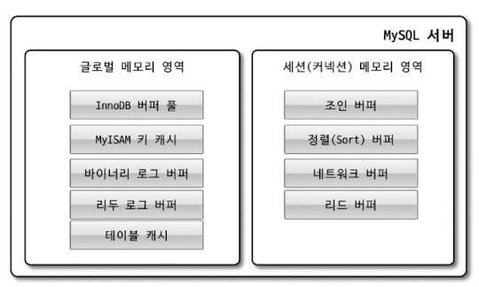
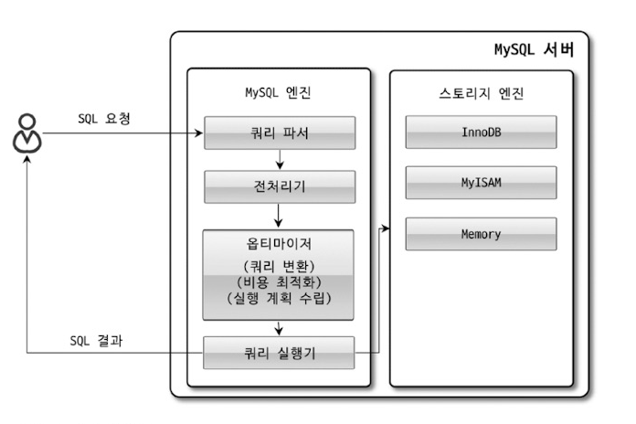

# Ch4 아키텍처
### MySQL 엔진 아키텍처

* mysql은 스레드 기반으로 동작한다
    * Foreground Thread: 사용자와의 커넥션
    * Background Thread: 커넥션 이외의 모든 행위들
* Storage Engine에는 기본적으로 InnoDB, MyISAM을 제공한다.
    * 스토리지 엔진은 핸들러 API를 구현한 어떤 구현체이든 사용 가능하다.
    * 핸들러 API: SQL 엔진의 쿼리 실행기에서 사용하기 위한 API
* 메모리 구조

* 
* 플러그인 방식으로 사용할 수 있다.
    * 스토리지 엔진 이외에도 인증, 검색 등의 행위를 컴포넌트들로 할 수 있다.
    * MySQL과 스토리지 엔진 중 어디서 해당 작업이 처리되는 지 구분해야 한다.
* MySQL 8.0부터 플러그인 -> 컴포넌트
    * 확장 가능성, 캡슐화
* 쿼리 실행 구조

* 쿼리의 결과를 캐싱하는 것은 좋은 기능이지만 조회 때만 가능하다. 따라서 제거된 상태
* 스레드풀은 엔터프라이즈 버전에서 제공
    * 커뮤니티에서 쓰고 싶으면 플러그인 설치
    * threadpool stall limit 환경 변수: 이 시간 내에 처리해야 한다. 그렇지 않으면 새 worker 스레드 추가
* 테이블의 메타데이터(딕셔너리) 트랜잭션 지원
    * InnoDB 엔진만 테이블에 저장해서 트랜잭션이 지원된다.
    * MyISAM 등은 .sdi(serialized dictionary information) 파일에 저장

### InnoDB 스토리지 엔진 아키텍처

* 스토리지 엔진 중 거의 유일하게 레코드 기반 락 제공
* PK를 기준으로 클러스터링(PK 값의 순서대로 저장), PK로 참조
    * MyISAM은 지원하지 않음. PK와 인덱스들은 구조적으로 동일, 물리 레코드 주소로 참조
* Foreign Key 지원
    * 변경 시에 다른 테이블에도 락이 걸리게 됨. 데드락 주의
* MVCC(Multi Version Concurrency Control)
    * Isolation 레벨 설정에 따라 보여지는 조회 결과가 다름
    * READ_UNCOMMITED의 경우 InnoDB 버퍼에서 읽고,
    * READ_COMMITED 등의 경우 Undo Log에서 이전의 값을 읽음
    * Undo 영역은 커밋 시점에 삭제된다. 하지만 끝나지 않은 트랜잭션이 존재하는 동안은 삭제되지 않는다.
* Non Locking Consistent Read
    * 조회는 항상 수행 가능하다.(Serializable 제외)
    * 다만 이러한 트랜잭션이 끝나지 않으면 Undo 영역이 계속 유지되므로 느려질 수 있다.
* 자동 데드락 감지
    * Wait-for List 그래프를 유지하며 데드락 감지 스레드가 검사한다.
    * 싸이클이 발생하면(데드락이 발생하면) Undo 로그가 가장 적은 트랜잭션을 종료시킨다.
    * MySQL 엔진에서의 잠금은 볼 수 없는데 innodb table locks 환경변수를 설정하면 테이블 레벨의 잠금도 감지할 수 있다.
    * 이러한 감지 행위 중에는 잠금 상태를 변경하지 못하도록 새로 잠금을 걸기 때문에 문제가 될 경우도 있다.
    * innodb lock wait timeout을 설정해서 일정 시간 잠금을 획득하지 못하면 실패하도록 하고, 데드락 감지를 끌 수도 있다.
* 자동 장애 복구
    * InnoDB 스토리지 엔진은 장애날 일이 거의 없다.
    * 하지만 장애가 나면 mysql은 시작되지 않고 종료된다.
    * 하지만 장애가 난다면, innodb force recovery 값을 1 ~ 6 으로 설정하며 실행해본다.
* InnoDB 버퍼 풀
    * 데이터나 인덱스를 캐싱, 쓰기 작업 지연
    * 용량은 적당히 작게 해두고 상황을 보면서 조금씩 늘리는 것이 좋다.
        * 전체 메모리의 50% 부터 늘려본다.
    * 버퍼 풀은 여러 인스턴스로 관리해서 락을 분리한다.
    * LRU, Flush, Free 세 가지의 리스트
        * LRU: 가장 안 찾은 페이지는 제거
        * Flush: 쓰기 지연을 위한 페이지
        * Free: 빈 페이지 리스트
    * Redo Log와 버퍼 풀
        * 버퍼 풀에는 Clean, Dirty 두 가지의 페이지를 관리함.
        * 리두 로그는 데이터가 변경될 때마다 새로 덮어 씌워짐.
        * 이때 LSN(Log Sequence Number)이 증가되면서 매겨짐.
        * 어느 순간 더티 페이지가 플러시 되면 그때의 LSN이 체크포인트가 됨.
        * 그럼 그 LSN보다 작은 더티 페이지와 리두 로그 엔트리는 디스크와 동기화돼야 함.
    * Flush List, LRU List
        * Flush List Flush: 더티 페이지를 일정 수준으로 유지하면서 디스크에 조금씩 기록
            * innodb io capacity 등의 관련 환경변수를 조절하면서 어느 정도로 유지되는 지 확인
            * 어댑티브 플러시 사용(환경변수가 아닌 새 알고리즘 사용, Default 설정이다)
    * 버퍼 풀 상태 백업 및 복구
        * 캐싱된 상태는 그렇지 않은 상태보다 몇십 배 빠르다.
        * 따라서 mysql을 새로 시작해야 할 때, 캐싱된 상태를 백업해둘 수 있다.
    * Double Write Buffer
        * Redo 공간은 절약을 위해서 변경점만 기록해둔다.
        * 따라서 플러시하는 도중 문제가 발생하면 데이터 복구가 힘들 수 있다.
        * 플러시가 일어날 페이지들을 Double Write Buffer 공간에 써두고, 디스크에 기록한다.
        * 시작할 때 Double Write Buffer와 디스크 내용이 다르면 옮겨 쓴다.
    * 언두 로그
        * 트랜잭션과 격리 수준을 위한 로그
        * 언두 로그의 급증 여부를 모니터링 하는 것이 좋다.
        * 8.0 버전부터는 Undo 로그는 시스템 테이블스페이스가 아닌 외부에 저장
        * 따라서 동적으로 잘라내고 추가 가능
            * Purge 스레드가 주기적으로 언두 로그를 삭제함
            * innodb undo log truncate가 on이면 삭제하고 반납도 함
    * 체인지 버퍼
        * 데이터가 변경될 때 해당 인덱스도 업데이트 돼야 한다.
        * Unique의 경우 즉시 결과를 알아야 하므로 체인지 버퍼 사용 불가능
        * 나머지의 경우 버퍼링 이후 백그라운드 스레드에 의해 병합됨.
        * 기본적으로 버퍼 풀의 25%까지 사용 가능(innodb change buffer max size)
    * 	리두 로그 및 로그 버퍼
         * Durable을 제공하기 위해 리두가 존재
         * 성능도 필요하므로 리두 로그 버퍼링이 가능
         * innodb flush log at trx commit 환경변수를 설정해서 언제 리두로그를 디스크에 쓸 지
         * 기본 값은 1초마다 디스크에 기록
         * 리두 로그 on/off 가능
* 어댑티브 해시 인덱스
    * 사용자가 직접 만드는 B-Tree 인덱스가 아닌, 자주 요청되는 데이터에 대해서 자동으로 만들어짐
    * 주소값을 키, 값 쌍으로 관리
    * 파티션 갯수를 관리해서 락을 부분적으로 가능
    * 디스크에서 페이지를 자주 읽어오는 경우는 도움이 안됨
    * 테이블이 삭제되거나 변경될 때, 해당 어댑티브 해시 인덱스들도 모두 제거돼야 함
    * show engine innodb status\G 등의 명령어로 얼마나 해시가 사용됐는지 볼 수 있음
        * 사용량이 높지 않다면 오히려 비활성화해서 버퍼 풀을 늘리는 것이 좋을 수 있음

### MyISAM 스토리지 엔진 아키텍처
* 	사용할 이유가 없는 엔진이다.

### Log 파일
* 	my.cnf 파일에서 log_error 파라미터의 경로에 저장
* 제너럴 쿼리 로그 파일을 남기도록 설정 가능
    * 쿼리 기록들을 볼 수 있음
* 슬로우 쿼리 로그
    * long query time 변수값보다 큰 쿼리들을 볼 수 있음 -> 튜닝을 위한 타겟
    * 전체적인 lock 시간도 나오는데 innodb에서는 MySQL 엔진의 테이블 잠금일 확률이 높으므로 큰 값이 나오더라도 별로 도움이 되지 않음
* 세 가지의 부분으로 로그가 나옴
    * 슬로우 쿼리 통계, 실행 빈도 및 실행 시간순 랭킹, 쿼리별 실행 횟수 및 누적 실행 시간 상세 정보
