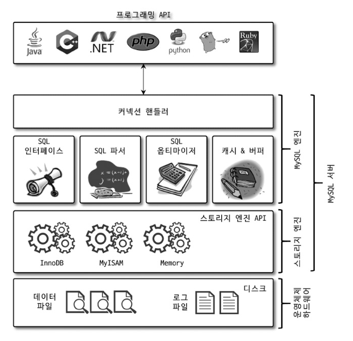
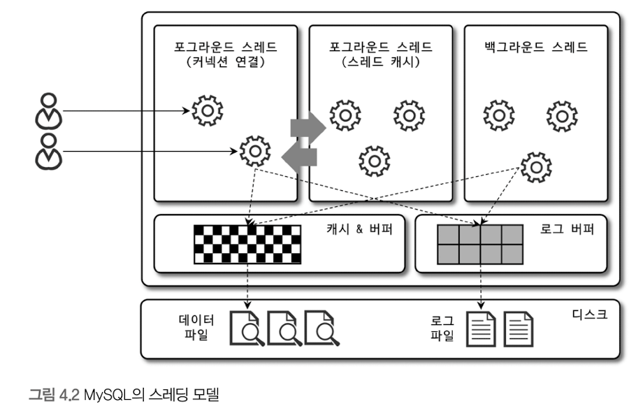
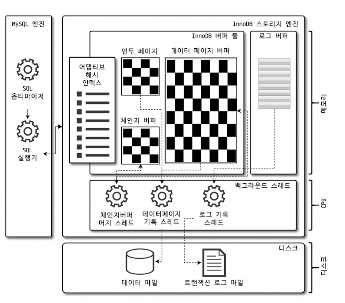
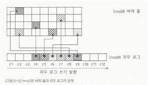

# 4.1 MySQL 엔진 아키텍쳐

## 4.1.1 MySQL 전체 구조


### 4.1.1.1 MySQL 엔진
MySQL 엔진의 구성은 다음과 같다.
- 커넥션 핸들러
  - 사용자의 접속과 쿼리를 요청을 처리한다.
- SQL 파서 및 전처리기
- 옵티마이저
  - 쿼리 최적화
- SQL 인터페이스
  - 여러 DB 문법이 지켜야하는 상호조약
- 캐시, 버퍼
  - 데이터들을 메모리 영역에 캐시해둔다.

### 4.1.1.2 스토리지 엔진
MySQL 엔진은 쿼리 최적화 등 DBMS 의 두뇌의 역할을 한다.
스토리지 엔진은 MySQL 에 의해 주도되어서 읽기, 쓰기 연산을 담당한다.
이때 스토리지 엔진은 여러 개를 동시에 사용할 수 있다.

### 4.1.1.3 헨들러 API
MySQL 엔진이 스토리지 엔진에 읽기 쓰기를 요청하는 것을 핸들러 요청이라 한다.
여기서 사용되는 API 를 핸들러 API 라 하고 스토리지 엔진들은 이 API 기반으로 호출된다.
만약 스토리지 엔진들에게 요청된 연산을 보고 싶다면
```
SHOW GLOBAL STATUS LIKE 'Handler%';
```
명령으로 확인 가능하다.

---

## 4.1.2 MySQL 스레딩 구조

위 그림과 같이 MySQL 서버는 스레드 기반으로 동작한다.
백그라운드 스레드는 설정에 따라 가변적이며
포그라운드 스레드 중 **'thread/sql/one_connection'** 스레드는 실제 사용자의 요청을 처리한다.
만약 같은 스레드가 여럿 보인다면 동일 작업을 병렬 처리하기 때문이다.

### 4.1.2.1 포그라운드 스레드(사용자 스레드, 클라이언트 스레드)
사용자의 요청을 처리하기 때문에 포그라운드 스레드는 최소한 서버에 접속된 클라이언트 수 만큼 존재한다.
작업이 종료될 경우 커넥션을 담당하던 스레드는 스레드 캐시로 돌아간다.
> 스레드 캐시
> 
> 스레드 생성 비용을 줄이기 위해 사전에 스레드를 미리 확보해두기 위해 사용한다. 

스토리지 별 포그라운드 스레드 차이
- InnoDB
  - 버퍼나 캐시까지만 담당
  - 쓰기 작업은 백그라운드 스레드에게 위임
    - 백그라운드 스레드는 지연 쓰기 기반으로 작동
- MyISAM
  - 읽기와 쓰기 모두 담당한다.

### 4.1.2.2 백그라운드 스레드
백그라운드 스레드 중 InnoDB 에만 존재하는 스레드는 다음과 같다.
- 인서트 버퍼를 병합하는 스레드
- 로그를 디스크로 기록하는 스레드
- InnoDB 버퍼 풀의 데이터를 디스크에 기록하는 스레드
- 데이터를 버퍼로 읽어 오는 스레드
- 잠금이나 데드락을 모니터링하는 스레드

이 중 중요한 아래 두 스레드이다.
- 로그를 디스크로 기록하는 스레드
- InnoDB 버퍼 풀의 데이터를 디스크에 기록하는 스레드
  - MYSQL 5.5 버전부터 쓰기 스레드를 1개이상 쓸 수 있다.
    - 기본적으로 4개의 스레드가 할당된다.
  - 쓰기 스레드를 스토리지에 따라서 적절히 설정해줄 필요가 있다.
    - DAS 나 SAN 같은 3차 스토리지 환경에서는 여러 디스크가 사용되기 때문에 적절하게 최적화하여 병렬처리하는 것이 좋음

---

## 4.1.3 메모리 할당 및 사용 구조
MySQL 에서 사용되는 메모리 공간은 크게 두가지가 있다.
1. MySQL 의 스레드들이 공유하는 글로벌 메모리 영역
2. 각 스레드 별 할당되는 로컬 메모리 영역(세션 메모리 영역)

### 4.1.3.1 글로벌 메모리 영역
모든 스레드에서 공유되는 메모리 영역이며
- 테이블 캐시
- InnoDB 버퍼 풀
- InnoDB 어댑티브 해시 인덱스
- InnoDB 리두 로그 버퍼

가 포함된다.

### 4.1.3.2 로컬 메모리 영역
사용자 별 스레드에 할당되는 영역이며
- 정렬 버퍼
- 조인 버퍼
- 바이너리 로그 캐시
- 네트워크 버퍼

가 포함된다.

해당 메모리 영역은 요청 동안 유지될 수도 있고 생성과 소멸의 과정을 겪을 수도 있다.
- 정렬 버퍼
- 조인 버퍼

의 경우 쿼리에 따라 메모리 영역을 할당했다 해제되며 생성과 소멸의 과정이 포함된다.

- 바이너리 로그 캐시
- 네트워크 버퍼

는 커넥션이 열린 동안 계속 할당되어 있다.

---

## 4.1.4 플러그인 스토리지 엔진 모델

MySQL 에서 복잡한 쿼리가 실행된다면 해당 쿼리를 분석하고 최적화 하는 과정은 MySQL 엔진이 담당한다.

해당 분석과 최적화가 끝났다면 데이터의 저장/쓰기 작업을 스토리지 엔진에 위임한다.

앞서 말했던 구조에서 각각의 역할을 뽑아낼 수 있다.

MySQL 엔진은 쿼리 최적화, 분석 등의 역할을 가지고 있고, 스토리지 엔진은 저장/쓰기의 역할을 가지고 있다.

이런 하나의 작은 역할 단위를 플러그인을 사용해서 구현할 수 있다.

그렇기 때문에 새로운 플러그인을 만든다면 일부분을 확장해 나갈 수 있다.

---

## 4.1.5 컴포넌트

앞서 말했던 플러그인 구조는 다음과 같은 단점이 있다.
- 플로그인은 오직 MySQL 서버와 인터페이스할 수 있고, 플러그인끼리는 통신할 수 없음.
- 플러그인은 MySQL 서버의 변수나 함수를 직접 호출하기 때문에 안전하지 않음(캡슐화 x)
- 플러그인은 상호 의존 관계를 설정할 수 없어서 초기화 어려움

플러그인은 모듈, 컴포넌트는 라이브러리라고 생각하면 좋다.

---

## 4.1.6 쿼리 실행 구조

### 4.1.6.1 쿼리 파서
쿼리 문장을 토큰으로 분리해 트리 형태로 만들며 기본적인 문법 오류를 잡아낸다.

### 4.1.6.2 전처리기
파서에서 만들어지 트리를 기반으로 문장의 구조적 결함을 찾아낸다.

실제 값이 있는지와 권한을 체크한다.

### 4.1.6.3 옵티마이저
쿼리를 최적화하여서 실행시킨다.

옵티마이저가 더 나은 선택을 하도록 유도해야한다.

### 4.1.6.4 실행 엔진

앞서 만들어진 계획대로 각 핸들러에게 요청해서 받은 결과를 또 다른 핸들러 요청의 입력으로 연결하는 역학을 수행한다.
실질적인 실행을 담당하는 부분이다.

### 4.1.6.5 핸들러
스토리지 엔진에 해당하는 부분으로 데이터의 읽기/쓰기를 담당한다.

---

## 4.1.7 복제

16장에서 다룬다.

---

## 4.1.8 쿼리 캐시 서버

쿼리 결과를 캐시하는 기능이었으나 동기화 문제 등으로 인해 삭제되었다.

---

## 4.1.9 스레드 풀

MySQL 엔터프라이즈 버전을 사용하면 쓰레드 캐시 대신 사용할 수 있다.

코어 친화적으로 설계하기 위해서 코어의 갯수 만큼 스레드를 기본적으로 할당하여서 컨텍스트 스위칭 비용을 줄인다.

기본적으로 코어 수만큼 할당된 스레드에서 스레드가 추가되는 플로우는 다음과 같다.

1. thread_pool_size 만큼의 스레드 그룹을 다 쓰고있다.
   - 중요한 것은 스레드 그룹의 갯수가 스레드 코어의 수만큼 할당된다는 것이다.
   - 그렇기 때문에 사전에 준비된 스레드 갯수 != 코어의 갯수이다.
2. thread_pool_stall_limit 만큼 기다린다.
3. 시간이 지나도 처리가 안된다면 thread_pool_oversubscribe 만큼 추가 요청을 받는다.
  - thread_pool_max_threads 를 넘을 수는 없다.
  - 이때 컨텍스트 스위칭 비용 증가

만약 thread_pool_stall_limit 을 0으로 가까운 값으로 설정해버린다면 스레드를 재사용한다는 장점은 전혀사용 하지 못한다.

그렇기 때문에 0에 가까운 값을 지양 하여 스레드 재사용의 효과를 보는 것이 좋다.

---

## 4.1.10 트랜잭션 지원 메타데이터

데이터베이스 서버에서 테이블의 구조 정보와 스토어드 프로그램 등의 정보를 데이터 딕셔너리 또는 메타 데이터라고 한다.

이 정보를 기존에는 파일로 관리했는데 파일 관리에는 트랜잭션이라는 개념이 없기 때문에 메타 데이터가 깨지는 경우가 발생했다.

그래서 이런 메타 데이터를 파일 기반이 아닌 테이블 기반으로 변경하여서 테이블 메타 데이터에 일관성을 얻을 수 있게 개선하였다.

---

# 4.2 InnoDB 엔진 아키텍쳐



## 4.2.1 프라이머리 키에 의한 클러스터링

InnoDB의 모든 테이블은 프라이머리 키를 기준으로 클러스터링 된다.
> 클러스터링
> 
> 기본키를 기반으로 정렬되고 일정 갯수만큼의 페이지로 나누어저 저장되는 것
- value 로 페이지를 식별할 수 있다.

MyISAM 의 경우 클러스터링 키를 지원하지 않는다.
- 데이터가 정렬되지 않는다.
- value 로 레코드르 식별할 수 있다.

---

## 4.2.2 외래 키 지원

외래키를 사용 단점
1. 부모 테이블과 자식 테이블 모두 해당 칼럼에 대한 익덱스 생성 필요
2. 잠금이 전파된다.
  - 데드락 걸리기 쉬움

또한 데이터를 변경할 때 제약사항이 걸리는데 이 때는 외래키 검사를 끌 수 있다.

---

## 4.2.3 MVCC

데이터가 변경이 된다면 해당 내역을 버퍼풀에 바로 반영한 뒤 그 전 데이터를 언두 영역에 보관한다.

변경된 데이터는 버퍼풀, 그 전 데이터는 언두 영역에 있을 때 격리성 수준에 따라서 어느쪽 데이터를 읽을 것인가 결정할 수 있다.

언두 영역은 해당 데이터를 변경한 작업의 commit 이후 바로 삭제 되는 것이 아니라 더이상 언두 영역을 참조하고 있는 트랜잭션이 없을 때 삭제한다.

---

## 4.2.4 잠금 없은 일관된 읽기

MVCC 방식을 통해서 변경 전 데이터를 저장하고 있으니 읽는 과정에서는 테이블에 락을 걸 필요가 없다.

단순히 격리 수준에 따라서 언두 혹은 버퍼 풀에서 데이터를 읽을 것인지 결정하면 된다.

트랜잭션이 끝나지 않는다면 언두 영역의 데이터가 소멸되지 못한다.

그래서 트랜잭션 주기를 짧게 잡는 것이 좋다.

---

## 4.2.5 자동 데드락 감지

주기적으로 잠금 대기 그래프를 검사해 교착 상태에 빠진 트랜잭션 중 하나를 제거한다.

가장 작은 언두 로그 레코드를 가진 트랜잭션을 롤백 시킨다.

InnoDB 는 스토리지 엔진으로 호출 부인 MySQL 엔진의 테이블 잠금을 기본적으로 볼 수 없다.

innodb_table_locks 이라는 시스템 변수를 통해 MySQL 엔진에서의 테이블 잠금도 고려할 수 있다.

데드락 스레드가 너무 느려지면 감지가 불가능해질 수 있다.

이때 데드락 스레드 검사 옵션을 끌 수 있는데 그렇다면 데드락 검사를 진행할 수 없다.

그래서 만약 데드락 검사 옵션을 끄게 된다면 innodb_lock_wait_timeout 옵션을 설정해서
일정 시간 이상 데드락에 빠져있었다면 자체적으로 실패하도록 만드는 것을 권장한다.(기본값인 50초 보다 훨씬 낮은 값으로 변경할 것)

---

## 4.2.6 자동화된 장애 복구

InnoDB는 장애 상황에 대한 자동화된 복구 작업이 있다.

그럼에도 불구하고 복구 작업이 되지않는다면 수동으로 복구레벨을 1~6으로 조정하면서 장애 복구 시도가 가능하다.

---

## 4.2.7 InnoDB 버퍼 풀

디스크의 데이터 파일이나 인덱스 정보를 메모리에 캐시해 두는 공간


### 4.2.7.1 버퍼 풀의 크기 설정

여기서 논하는 메모리는 RAM 을 말한다.

버퍼풀 내부에는 128MB 의 청크를 관리하고 있다.

버퍼풀은 여럿으로 나눌 수 있는데 나누어진 각각을 버퍼풀 인스턴스라 부른다.

1GB 미만이라면 버퍼풀은 한 개, 그 이상 이라면 기본적으로 8개로 나누어진다.

버퍼풀을 몇 등분할 것인가 명시할 수 있는데 각 인스턴스 별로 5GB 가 되도록 설정하는 것이 좋다.

---

### 4.2.7.2 버퍼 풀의 구조

InnoDB 는 페이징된 크기만큼의 조각을 읽어와서 버퍼 풀에 저장한다.

이 말은 필요한 데이터 가 포함된 페이지를 읽기 때문에 필요한 데이터만을 꼭 읽어온다는 것이 아닌, 인접한 데이터를 페이지 단위로 같이 가져온다는 뜻이다.

InnoDB 는 이 조각들을 관리하게 위해서 3가지 자료 구조를 관리한다.

1. LRU
   - 최근 호출을 기준으로 정렬된 리스트
2. 플러시
   - 변경된 버퍼 풀 속 데이터 페이지(더티 페이지)들의 목록
3. 프리
   - 아직 채워지지 않은 페이지들의 목록

---

### 4.2.7.3 버퍼 풀과 리두 로그



버퍼 풀의 두 가지 역할에 대해서 말해보자.

1. 캐시 기능
   - 버퍼 풀은 메모리(RAM)에 사용할 것으로 예상되는 데이터를 담아 두기 때문에 빠르다.
2. 버퍼링 기능
   - 쓰기 기능은 디스크와 관련된 작업임으로 상당히 느리다.
   - 그래서 현재까지 어떤 데이터가 모였는지 관리한다.
     - 리두 로그에 바뀐 데이터들을 추적한다.
       - 데이터 변경을 계속 관리하면 결국 리두 로그를 덮어쓰기 시작한다.
       - 사용 여부에 따라서 리두 로그를 분리하고 사용하고 있는 리두 로그를 활성 리두 로그라고 한다.
   - 한번에 많은 연산을 처리해서 성능을 개선시킨다.

이 중 
- 리두 로그에 바뀐 데이터들을 추적한다.
- 한번에 많은 연산을 처리해서 성능을 개선시킨다.

부분은 LSN 을 사용한다.

LSN 은 로그 파일이 새로 생길 때 마다 할당받는 계속 증가하는 번호이다.

스토리지 엔진은 주기적으로 버퍼 풀의 더티 페이지를 디스크에 반영하는데 이때 가장 최근의 LSN 을 체크포인트로 삼고 이것을 기준으로 반영한다.

즉, 마지막 체크 포인트의 LSN ~ 가장 최근의 LSN 까지를 반영한다.

두 LSN 차이를 **체크포인트 에이지** 라고 한다.

리두 로그 파일의 크기는 결국 버퍼 풀에서 얼마나 더티 페이지를 가질 수 있느냐를 결정한다.

그렇기 때문에 메모리 크기에 따라서 적절한 리두 로그 파일의 크기를 결정해야한다.

---

### 4.2.7.4 버퍼 풀 플러시

더티 페이지를 디스크에 동기화 하는 작업으로

두 가지 기능이 있다.

1. 플러시 리스트(Flush_list) 플러시
2. LRU 리스트(LRU_list) 플러시

### 4.2.7.4.1 플러시 리스트 플러시

리두 로그는 바뀐 버퍼 풀의 데이터를 담고 있다.

이 리두 로그를 재활용 하기 위해서는 결국 예전 리두 로그를 삭제해야한다.

또한 리두 로그를 삭제하기 전에는 해당 더티 페이지는 디스크에 반영돼야한다.

이 반영 과정에서 도움을 줄 수 있는 여러 설정들이 있다.

- innodb_page_cleaners
  - 더티 페이지를 처리하는 cleaner thread 의 갯수를 지정해준다.
    - 버퍼풀 인스턴스와 똑같이 생성해줘야 하나의 스레드 <-> 하나의 인스턴스로 최적 효율이 나온다.
  - 만약 버퍼 풀 인스턴스보다 많이 설정하면 자동으로 버퍼 풀 인스턴스 갯수만큼 준다.
  - 반대로 적다면 하나의 스레드가 여러 버퍼 풀 인스턴스를 관리해서 성능 이슈가 있다.
- innodb_max_dirty_pages_pct
  - 더티 페이지가 버퍼 풀 속 몇 % 까지 존재할 수 있는지 결정한다.
  - 기본값 유지 권장
- innodb_max_dirty_pages_pct_lwm
    - 일정 % 이상 더티 페이지가 발생한다면 조금 씩 더티 페이지를 반영하도록 만드는 옵션이다.
    - 주기적으로 Dirty Page 를 디스크에 반영하지만 쓰기 작업이 몰려서 innodb_max_dirty_pages_pct 가 넘어버리면 쓰기 작업이 폭증한다.
    - 그래서 90 % 라는 극한으로 몰리기 전 조금씩 쓰기 작업을 진행하도록 만드는 것이다.
> 그렇다면 innodb_max_dirty_pages_pct_lwm 를 설정하면 innodb_max_dirty_pages_pct 까지 도착할 수 없는 것이 아닐까?
>
> ->  innodb_io_capacity 가 존재하는 것을 근거로 만약 디스크에 쓰기 작업보다 쓰기 작업이 몰린다면 결국 90 % 에 도달할 수 있다.
- innodb_io_capacity
  - 한번에 얼마나 dirty page 를 반영할 것인가 결정하는 값
  - 대역폭이라 보면 된다.
  - 일반적인 상황에서 사용하는 대역폭
- innodb_io_capacity_max
  - 쓸 수 있는 최대 IOPS 를 설정해주는 것
  - 하지만 최대 IOPS 대로 사용하지 않고 내부 알고리즘에 의해서 변경된다.
- innodb_adaptive_flushing
  - 디스크 스펙을 일일히 적어주는 것이 귀찮으니 내부 알고리즘에게 맡겨서 대역폭을 설정해준다.
- innodb_adaptive_flushing_lwm
  - 결국 플러싱 전략은 리두 로그가 쌓이는 속도를 기반으로 판단한다.
  - 기본으로 활성 리두 로그가 10%를 넘어서면 발동한다
- innodb_flush_neighbors
  - 근접한 더티 페이지들을 한번에 묶어서 디스크에 기록할지 결정한다.
  - SSD 오면서 별로 안중요해져서 비활성 모드 유지가 좋다.

### 4.2.7.4.2 LRU 리스트 플러시

플러시 리스트는 버퍼 풀의 변경 내역을 저장하는 역할이었다면 이것은 버퍼 풀의 내용을 삭제해 정리하는 내용이다.

각 버퍼 풀 마다 innodb_lru_scan_depth 만큼 스캔한다.

결국 버퍼 풀 인스턴스 * innodb_lru_scan_depth 만큼 탐색한다.

### 4.2.7.5 버퍼 풀 상태 백업 및 복구

시스템을 껐다 키면 버퍼 풀에 아무 데이터가 없어서 느리다.

그래서 미리 버퍼 풀을 세팅하기 위해 미리 시스템을 돌리는 워밍업을 잰했었었다.

현재는 설정으로 버퍼 풀에 데이터를 적재할 수 있다.

### 4.2.7.6 버퍼 풀의 적재 내용 확인

버퍼 풀에 테이블의 어떤 페이지가 주로 버퍼 풀에 존재했는지 확인할 수 있다.

---

## 4.2.8 Double Write Buffer

InnoDB 페이지의 변경된 내용만 리두 로그에 기록한다.

디스크 쓰기 과정에서 일부만 기록될 경우 발생할 수 있는 문제를 Double Write Buffer 를 통해 해결한다.

디스크에 쓰기 전 버퍼에 적을 내용을 먼저 반영해둔다.

만약 비정상 종료로 일부만 반영되어 있다면 실제 디스크에는 Write Buffer 내용을 적는다.

---

## 4.2.9 언두 로그

언두 로그는
- 트랜잭션 보장
- 격리 수준 보장

을 위해서 사용된다.

---

### 4.2.9.1 언두 로그 모니터링

언두 로그는 데이터가 변경되지 전 상태를 저장한다.

트랜잭션이 종료되지 않는다면 언두 로그는 삭제되지 않는다.

그래서 언두 로그를 모니터링 하는 것은 중요하며 모니터링 기술을 제공한다.

---

### 4.2.9.2  언두 테이블스페이스 관리

언두 로그를 파일로 저장하면서 확장 가능해졌다.

언두 공간을 반납하기 위해서 Purge Thread 가 커밋된 undo 영역을 주기적으로 삭제해준다.

수동으로 undo 영역을 삭제할 수도 있다. 하지만 언두 테이블 스페이스가 최소 3개 이상이어야 한다.

---

## 4.2.10 체인지 버퍼

데이터의 변경이 일어났다면 테이블의 인덱스에도 변경을 반영해야함.

버퍼 풀에 있으면 바로 반영하면 되지만 디스크에 있으면 바로바로 하기에 성능이 떨어지기에 체인지 버퍼에 미리 적어두고 사용한다.

유니크 인덱스는 고유성을 판단해야하기 때문에 체인지 버퍼를 사용하지 못한다(버퍼 풀에 모든 디스크의 데이터를 가져오지 못하기 때문).

체인지 버퍼는 기본적으로 버퍼 풀의 25% 로 설정 되어 있으며 50% 까지 늘릴 수 있다.

---

## 4.2.11 리두 로그 및 로그 버퍼

영속성(Durable)을 제공하기 위해서 리두 로그가 존재한다.

리두 로그를 디스크로 저장하는 것은 많은 자원을 요구함으로 로그 버퍼가 제공된다.

로그 버퍼를 언제 디스크에 반영할 것인가 설정 가능하다.

---

### 4.2.11.1 리두 로그 아카이빙
> 아카이브란?
> 
> 사본을 만드는 것을 의미한다.

리두 로그 사본을 만들 수 있다.

---

### 4.2.11.2 리두 로그 활성화 및 비 활성화

리두 로그를 저장하는 기능을 껐다 킬 수 있다.

---

## 4.2.12 어댑티브 해시 인덱스

사용자가 직접 만드는 B- Tree 인덱스와 다르게 실제 호출을 기반으로 만들어지는 런타임 인덱스이다.

버퍼 풀에 올라와 있는 데이터 페이지에 대해서만 생성된다.

껐다 킬 수 있다.

hit률을 확인할 수 있다.

키(B- Tree 인덱스 번호)와 value(인덱스의 실제 키 값을) 관리한다.

키 값을 갖는 이유는 어느 인덱스로의 정보인지 알기 위해서이다.

> 아마 인덱스 삭제 변경시 쓰지 않을까?

하지만 어뎁티브 해시 인덱스는 팔방미인이 아니다.

- 디스크 읽기가 많은 경우
- 특정 패턴의 쿼리가 많은 경우(조인이나 LIKE 패턴 검색)
- 매우 큰 데이터를 가진 테이블의 레코드를 폭넓게 읽는 경우

에는 성능 향상에 도움이 되지 않고

- 디스크의 데이터가 InnoDB 버퍼 풀 크기와 비슷한 경우(디스크 일긱가 많지 않은 경우)
- 동등 조건 검색(동등 비교와 IN 연산자)이 많은 경우
- 쿼리가 데이터 중에서 일부 데이터만 집중되는 경우

성능이 잘 나온다.

또한 인덱스 삭제시 어댑티브 해시 인덱스에도 반영해줘야 하는 비용이 들기 때문에 적용할 지 말지 잘 결정해야한다.

# 4.3 MyISAM 스토리지 엔진 아키텍쳐

InnoDB 선에서 정리가능.

# 4.4 MySQL 로그 파일

크게 다음 3가지에 대한 로그를 얻을 수 있다.

1. 에러 로그 파일
2. 제너럴 로그 파일
3. 슬로우 쿼리 로그


