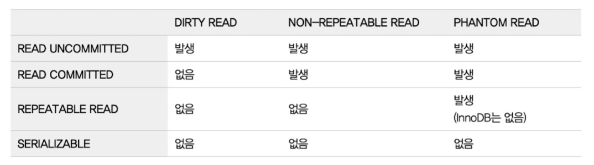

# Ch5 트랜잭션과 잠금
### 트랜잭션
* 성공하면 Commit, 실패하면 RollBack
* 트랜잭션의 범위는 최소화
    * 네트워크 작업이 있는 경우는 반드시 트랜잭션에서 배제

### MySQL 엔진의 잠금
* 글로벌 락은 MySQL 서버 전체에 대해서 걸린다.
    * MyISAM이나 MEMORY 테이블에서 백업을 할 때 필요
    * 모든 쿼리가 완료되고 얻을 수 있기 때문에 잘못하면 장시간 전체 대기
    * mysqldump 등의 백업 프로그램이 사용할 수도 있음
* InnoDB에서는 글로벌 락 대신 백업 락이 존재
    * 스키마 변경 및 사용자 인증 관련 변경 불가능
    * 테이블의 데이터 변경은 허용
* 테이블 락
    * 명시적으로 얻을 수는 있지만 사용할 필요가 없음
    * 묵시적 테이블 락은 MyISAM이나 MEMORY 테이블에서 데이터 변경 시 획득
    * InnoDB의 경우
        * 데이터 변경 시 테이블 락 획득
        * 하지만 스키마 변경에만 영향을 미치는 락
* 네임드 락
    * 커스텀 락이다.
    * 한 번에 다양한 레코드를 변경할 때 자주 데드락이 발생하는데 이때 사용하면 해결 가능
        * ex: 네임드락을 얻으면 여러 테이블들의 락을 동시에 얻음
        * 아니면 대기
* 메타데이터 락
    * 테이블이나 뷰의 이름이나 구조를 변경할 때 획득
    * ex: 테이블의 구조를 변경해야 할 때
        * 언두 로그의 증가, 버퍼의 누적, MySQL 서버 DDL 싱글 스레드 등의 문제 발생
        * 새로운 테이블을 생성해두고 여러 스레드를 사용해서 기존 데이터 복사
        * 이후 메타데이터 락과 테이블 락을 사용해서 테이블 바꾸기

### InnoDB 스토리지 엔진 잠금
* 레코드 락
    * 인덱스의 레코드를 락(레코드 자체 락 X)
* 갭 락
    * 레코드 사이의 간격에 insert를 제어하는 락
* 넥스트 키 락
    * 소스 서버에서 만들어낸 결과가 레플리카 서버에서 동일하게 만들도록 보장하는 목적
    * 바이너리 로그 포맷이 STATEMENT(쿼리를 그대로 저장)라면 변경을 위해 검색하는 레코드에 넥스트 키 락이 걸린다.
        * 넥스트 키 락과 갭 락으로 데드락 발생이 자주 일어나기 때문에 ROW 포맷으로 바꾸는 것이 좋다.
        * MySQL8 에서는 ROW 포맷이 기본 설정
* 자동 증가 락
    * AUTO_INCREMENT 사용 시 자동 획득 및 해제
    * innodb autoinc lock mode의 값으로 작동 방식 변경 가능
        * 0: 모든 INSERT 문장은 자동 증가 락
        * 1: INSERT 되는 레코드의 갯수를 미리 알 수 있을 때는 래치를 이용해서 처리
        * 2: 모두 래치 사용(연속적인 PK 값을 보장하지 않음)
        * MySQL8에서는 2가 기본 설정(ROW 포맷을 쓰기 때문)
* 인덱스와 잠금
    * 인덱스를 잠그기 때문에 수정 쿼리에서 WHERE 절의 조건 인덱스 여부 중요
        * WHERE 절 조건에 인덱스가 없다면 테이블을 풀 스캔하면서 모든 레코드 락
        * 인덱스가 있다면 해당 인덱스의 레코드들만 락
    * InnoDB의 인덱스 설계는 매우 중요
* 레코드 수준의 락 확인 및 해제
    * 각 트랜잭션이 어떤 잠금을 기다리고 있는지, 어떤 잠금을 가지고 있는 지 쉽게 조회 가능
    * information_schema에 있던 메타 정보들이 deprecated 되면서 performance_schema로 이동
    * data_locks 테이블에서 전체 락을 조회 가능
        * IX, X, REC NOT GAP 등의 잠금 모드

### MySQL의 격리 수준
* SERIALIZABLE이 아니면 성능의 차이는 없음
* 
* InnoDB는 REPEATABLE READ 격리 수준에서도 PHANTOM READ 발생하지 않음
* 일반적으로는 READ COMMITTED, REPEATABLE READ 중 하나 사용
* READ UNCOMMITTED
    * 커밋되지 않은 정보도 조회 가능(더티 리드)
    * 오류가 생길 정보여도 다른 곳에서 사용 가능
    * 정합성 문제 매우 높음
* READ COMMITTED
    * 온라인 서비스에서 가장 많이 선택되는 격리 수준
    * 커밋된 정보만 조회 가능(언두  영역에서 리턴)
    * 하나의 트랜잭션에서 다른 결과를 가져올 수 있는 REPEATABLE READ 정합성 문제
    * ex: 한 트랜잭션에서 계좌의 총액을 계산할 때 계속 달라질 수 있음
        * 가장 중요한 것은 이러한 결과를 예측할 수 있어야 함
* REPEATABLE READ
    * MySQL의 기본 격리 수준
    * 	바이너리 로그를 가진다면 이 수준 이상 사용해야 함
         * 변경된 데이터를 그대로 로그로 남기기 때문에 source server와 replica server가 다를 수 있으므로
    * MVCC 방식으로 변경하기 때문에 동일한 트랜잭션에서 동일한 결과 리턴
        * 	READ COMMITTED도 언두에서 읽어오지만 몇 번째 이전의 결과인지 차이
    * SELECT … FOR UPDATE 쿼리로 조회할 경우 현재 레코드의 값을 가져오므로 PHANTOM READ 발생
* SERIALIZABLE
    * 가장 단순하고 가장 엄격한 격리 수준
    * Non-locking consistent read가 아닌 조회 시에도 락 사용
    * PHANTOM READ 발생 안함
        * 하지만 갭 락, 넥스트 키 락을 쓰는 InnoDB에서는 REPEATABLE에서도 PHANTOM READ 발생 안함(해당 범위 모두 락을 걸기 때문에 INSERT 불가능)
