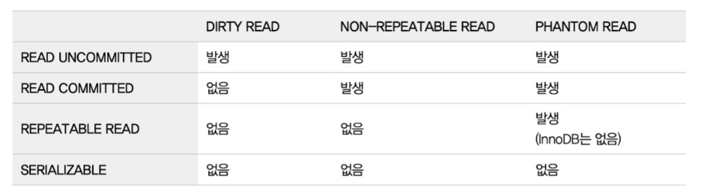

# 트랜잭션

## 5.1.1 MySQL 에서의 트랜잭션

트랜잭션은 기능들을 하나의 단위로 묶어서 모두 실행되거나(commit) 모두 실패한다(rollback).

MyISAM 은 트랜잭션을 지원하지 않고 InnoDB 는 트랜잭션을 지원한다.

## 5.1.2 주의사항

외부 환경에 의존하는 기능은 다음과 같은 이유로 트랜잭션 범위에서 분리하는 것이 좋다.

1. 커넥션 풀이 부족해지고
2. DB 연결 스레드가 오래 유지된다.

# 5.2 MySQL 엔진의 잠금

MySQL 엔진이라 하면 스토리지 엔진을 제외한 부분을 말하는 것.

MySQL Engine Lock -> Storage 에 영행을 미치지만

Storage Lock -x> MySQL Engine 에는 영향을 미치지 못한다.

## 5.2.1 글로벌 락

FLUSH TABLES WITH LOCK 명령으로 획득할 수 있는 락이다.

글로벌 락의 영향 범위는 MySQL 서버 전체이며, 한 세션이 소유하면 다른 세션은 **SELECT 를 제외한** 다른 DDL, DML 문을 실행할 수 없다.

> 왜 SELECT 는 가능할까?
>
> 글로벌 락은 전체에 대한 읽기 락을 얻는다.
> 읽기 락은 다른 읽기 락을 허용하지만 쓰기 락은 허용하지 않는다.
> 그 결과 쓰기 작업을 불가하고 읽기 작업은 가능하다.

글로벌 락이 쓰기 작업을 막기 때문에 실제 서비스에 영향을 준다.
그래서 InnoDB 는 쓰기 작업을 진행할 수 있도록 조금 완화된 백업 락을 사용한다.
백업 락을 사용하면 Insert 와 delete 같은 DML 은 가능해지지만 DDL 은 불가능하다.

> 왜 DDL 은 안될까?
> 
> XtraBackup 예시로 들면 다음과 같다.
> XtraBackup 은 한 시점의 데이터를 복사한다.
> 그 후 변경된 사항은 리두 로그에서 가져와서 반영한다.
> DML 에 의한  변경 내역은 리두 로그에 남지만 DDL 은 다른 곳에 남는다.
> 그래서 DDL 변경에 의한 내역은 추적할 수 없다.

## 5.2.2 테이블 락

테이블 레벨에 거는 락이다.

테이블 락도 범위가 큰 락이라 명시적으로 잘 사용하지는 않는다.

하지만 MyISAM 이나 Memory Engine 의 경우에는 쓰기 작업을 할 때 묵시적으로 테이블 락을 건다.

InnoDB 는 대부분 레코드 레벨로 락을 건다.

InnoDB 도 테이블 레벨에 락이 걸리긴 하지만 보통 DML 에서는 무시되고 DDL 만 해당한다.

## 5.2.3 네임드 락

사용자가 커스텀하여서 락을 걸 수 있다.

한번에 너무 많은 락을 얻는 시스템의 경우 데드락에 빠지기 쉽다.

이때 사용자가 임의로 네임드 락을 이용해서 잘게 조개는 방식으로 데드락을 해결할 수 있다.

## 5.2.4 메타데이터 락

데이터베이스 객체(테이블이나 뷰 등)의 이름이나 구조를 변경하는 경우에 획득하는 잠금이다.

명시적으로 얻기보단 RENAME 과 같은 명령어로써 얻는다.

테이블을 바꿔야할 때 사용할 수 있다.
- Online DDL 을 이용해서 바꿀 수도 있다.
> 테이블 구조를 바꾸는 툴로써 중단하지 않은 상태에서 실행가능하다.
> 
> 하지만 옮기는 과정 중에 들어온 DML 은 버퍼에 저장하는데 이 버퍼 공간이 넘치게 되면 작업이 실패한다.
> 
> 또한 이 작업은 단일 스레드 작업이기 때문에 느리다.
- 하지만 Online DDL 의 단점을 개선하기 위해 다음과 같은 방식을 사용할 수 있다.
1. Data 들을 멀티 스레드로 빠르게 옮기고
2. 최대한 인접한 데이터까지 옮긴 후 남은 일부 데이터는 락을 얻어서 옮긴 후 Rename(메타데이터 락)을 사용해서 새로운 테이블로 옮긴다.

마지막 2번 과정에는 일시적으로 쓰기 락이 테이블에 걸리기 때문에 쓰기 작업이 지연된다.

그렇기 때문에 최대한 인접한 데이터까지 복사해둔 후 2번 작업을 진행할 것을 권장한다.

# 5.3 InnoDB 스토리지 엔진 잠금

InnoDB 는 별개로 스토리지 엔진 내부에서 잠금을 건다.

이때 레코드 단위로 걸기 때문에 동시성이 좋지만 이원화된 잠금 방식으로 모니터링이 힘들었다.

하지만 최근에는 모니터링 방법이 추가되었다.

## 5.3.1 InnoDB 스토리지 엔진의 잠금

레코드, 갭, 넥스트 락이 있다.

### 5.3.1.1 레코드 락

레코드 자체만을 잠그는 것이다.

이 때 중요한 것은 테이블에 대한 락을 거는 것이 아니라 인덱스 레코드를 잠그는 것이다.

인덱스를 만들지 않았더라도 자동으로 생성된 클러스터링 인덱스가 있다.

> 자동으로 생성된 클러스터링 인덱스
> 
> mysql 은 다음과 같은 두 조건에서 자동으로 클러스터 인덱스를 만들어낸다.
> 1. primary key(2번 과 동시에 있을 경우 우선순위가 더 높다)
> 2. unique + not null

### 5.3.1.2 갭 락

레코드 사이에 새로운 레코드가 생성되는(insert) 것을 막는다.

### 5.3.1.3 넥스트 키 락

레코드 락과 갭 락이 합쳐진 형태이다.
소스 서버에서 만들어낸 결과가 레플리카 서버에서 동일하게 만들도록 보장하는 것이 주 목적이다.
바이너리 로그 포맷이 STATEMENT(쿼리를 그대로 저장)라면 변경을 위해 검색하는 레코드에 넥스트 키 락이 걸린다.
넥스트 키 락과 갭 락으로 데드락 발생이 자주 일어나기 때문에 ROW 포맷으로 바꾸는 것이 좋다.
MySQL8 에서는 ROW 포맷이 기본 설정

> 바이너리 로그와 락이 무슨 뜻일까?
> 
> MySQL 의 빈로그 혹은 바이너리 로그는 MySQL 서버 인스턴스의 데이터 변경사항들에 대한 정보를 포함하는 로그 파일의 세트이다.
> 
> 이 바이너리 로그를 기반으로 복제나 복구를 진핸한다.
>
> 바이너리 로그는 크게 3가지 형태로 존재한다.
> 
> 1. STATEMENT : 실행된 쿼리 그 자체를 가지고 있는 것이다. 그래서 복제나 복구를 할 때 쿼리를 실행시켜서 데이터를 만들어낸다.
> 2. ROW : 실행된 쿼리를 갖고 있는 것이 아니라 그 결과 값은 행들을 변화를 저장하는 방식이다.
> 3. mix : 위 두 개를 섞을 수 있다고 한다.
> 
> STATEMENT 의 경우에는 실제로 쿼리를 실행시켜야 하기 때문에 락을 크게 거는 것이다.

### 5.3.1.4 자동 증가 락

AUTO_INCREASE 라는 칼럼 속성에 대한 락(테이블 수준)을 얻을 수 있다.

자동 증가 락은 값을 가져오는 그 찰나의 순간만 락을 빠르게 걸고 해제한다.

이 자동 락 방식을 5.1 이상부터는 innodb_autoinc_lock_mode 를 통해 변경할 수 있다.

0. : 모든 insert 를 자동 증가 락 사용.
1. : insert 의 건수를 정확히 예측할 수 있을 때는 래치(뮤텍스) 이용.
예측할 수 없다면 자동 증가 락을 이용한다.
예측할 수 있을 경우 연속된 값들을 받아오고 예측할 수 없을 때는 락을 걸고 기다리면서 증가 값을 받기 때문에 결국 어떤 경우든 연속된 값들을 갖는다.
그래서 하나의 insert 문의 값들은 연속된 값을 갖을 수 있고 이를 연속 모드라 부른다.
물론 다른 insert 문이 실행되다 실패해서 전체적으로 본다면 연속된 값이 아닐 수 있다.
2. 무조건 래치를 이용한다.
그래서 하나의 insert 문에서 생성된 레코드들의 값들이 연속되지 않을 수 있다.

> STATEMENT 기반 바이너리 로그라면 레벨 1을 권장한다.
> 
> 레벨 2로 실행할 경우 STATEMENT(쿼리)의 실행 값이 다를 수 있기 때문에 락을 거는 1번 방식으로 쿼리 순서에 따라서 증가된 값을 얻어야한다.

## 5.3.2 인덱스와 잠금

InnoDB 는 레코드를 잠구지 않고 인덱스를 잠군다.

- 인덱스가 있을 경우 -> 인덱스 검색을 위해 마주친 모든 인덱스 데이터에 락을 건다
- 인덱스가 없을 경우 -> 테이블에 있는 모든 레코드를 잠구게 된다.

그래서 MySQL 은 인덱스 설게가 정말 중요하다.

## 5.3.3 레코드 수준의 잠금 확인 및 해레

잠금 현황을 확인할 수 있다.

# 5.4 MySQL 격리 수준
MySQL 의 격릭 수준은 아래 그림과 같다.

각각에 대한 자세한 설명은 생략하고 REPEATABLE READ 만 집중해보자면

## REPEATABLE READ 와 PHANTOM READ

REPEATABLE READ 레벨로 격리성을 설정한다면 위 표를 기반으로는 InnoDB 의 경우 Phantom Read 가 발생하지 않는다고 한다.

하지만 책에서는 또 Phantom Read 가 발생할 수 있다는데 어떤 말이 맞는 말일까?

결론은 InnoDB 의 동작 방식으로 인해서 Phantom Read 가 방지될 수는 있지만 완벽하지는 못하다.

Phantom Read 가 발생하는 첫 번째 이유로는

1. Repeatable Read 는 첫 번째 select 문이 실행되면 해당 시점의 데이터에 [snapshot을 저장한다](https://dev.mysql.com/doc/refman/8.0/en/glossary.html#glos_isolation_level)

2. 이 스냅샷은 데이터 읽기 [DML(SELECT)에서 사용한다.](https://dev.mysql.com/doc/refman/8.0/en/innodb-consistent-read.html) 즉, 다른 UPDATE나 DELETE는 snapshot 에 대한 업데이트, 삭제가 아닌 실제 데이터에 대한 변경이 이루어진다.
3. 즉, 다른 트랜잭션으로 인해서 추가된 데이터에 대한 변경을 진행할 수 있다는 것이다. 하지만 이 데이터를 select 로 진행한다면 select 는 snapshot 에서 데이터를 읽어오기 때문에 잡히진 않고 delete 나 update 를 통해서만 접근가능하다.
4. 만약 update 를 통해서 다른 트랜잭션에서 추가된 데이터를 변경한다면 그때 부터는 이 변경된 데이터에 대한 select 가 가능해지고 이를 snapshot 이 깨졌다고 한다.

이런 측면에서 Phantom Read 가 깨졌다고 볼 수 있고 두 번째로는

만약 트랜잭션 내에 조회를 SELECT ... FOR UPDATE(SHARE ...) 로 진행한다면

최신 데이터 즉, 다른 트랜잭션에서 가져온 데이터를 [읽을 수 있다.](https://dev.mysql.com/doc/refman/8.0/en/innodb-consistent-read.html)

이런 두 가지 방식으로 Phantom Read 가 깨질 수 있다.

또한 InnoDB 는 Repeatable Read 에서 Phantom Read 를 방지하기 위한 수단도 있는데 이것도 완벽하진 못한 것으로 추정된다.

그 이유는

1. 기본적으로 repeatable read 는 lock 을 걸지 않고 snapshot 에서 읽는다.
2. 만약에 lock 을 걸면서 read 를 수행한다면 (for update) [두 가지로 나뉜다.](https://dev.mysql.com/doc/refman/8.0/en/innodb-transaction-isolation-levels.html)
    - 만약 unique index 에 대한 unique search 였다면 해당 인덱스 레코드 하나만 잠군다.
    - 만약 unique index 도 아니였거나, unique search(id = 1)이 아닌 범위 검색 이였다면 gap lock 혹은 next-lock 을 사용한다.
      - unique search 가 아니였을 경우에는 해당 범위에 대한 lock 을 건다.
      - unique search 였으나 해당 항목에 대한 index 가 아니였다면 마주치는 모든 항목에 대한 lock을 건다.(5.3.2 참고)
        - 이때 마주친 모든 항목에 대해서 [앞쪽 gap에 대한 Lock 을 건다.](https://dev.mysql.com/doc/refman/8.0/en/innodb-locking.html#innodb-next-key-locks)

