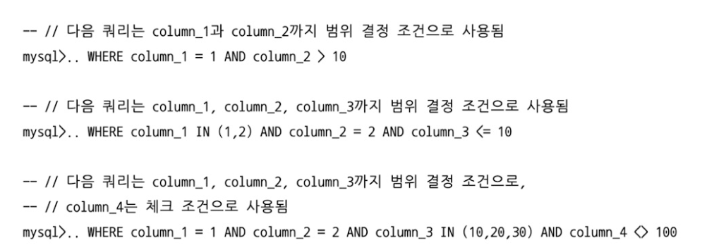

# Ch8 인덱스
### 디스크 읽기 방식
* SSD는 전자식 매체이므로 팬을 돌리는 HDD보다 빠르다
    * Sequential 접근은 비슷하지만 Random 접근이 훨씬 빠르다
    * 메모리에 올릴 페이지가 적기 때문
* RAID
    * 여러 개의 디스크를 하나의 논리적 디스크로 써서 빠르게 수행할 수 있음
        * 병렬로 I/O 처리
        * 안정성 향상

### 인덱스란
* Key-Value로 주소값을 저장
* 인덱스를 쓰면 삽입 속도를 줄이고 조회 속도를 늘림
* PK를 제외한 모든 인덱스는 Secondary Key
* B-Tree 기반 또는 Hash 기반을 보통 사용

### B-Tree
* Balanced Binary Tree
* 인덱스 기반의 트리로 저장
    * 리프 노드까지 내려가면 인덱스-PK 의 형식으로 저장돼있음
* 실제 레코드는 PK를 기반으로 클러스터링(PK 기준 정렬된 상태)
* MyISAM 기반은 물리 주소를 가지지만 InnoDB의 경우 PK를 주소로 사용
    * 따라서 InnoDB는 세컨더리 인덱스로 조회한 PK로 다시 한 번 조회해야 함
* 인덱스 삽입 비용 = 인덱스 없는 비용 + (1.5 * 인덱스 갯수)
    * 인덱스 없는 테이블 = 1
    * 인덱스 3개 = 1 + 1.5*3
* InnoDB는 삽입 시 인덱스에 즉시 반영하지 않고 체인지 버퍼 사용
    * 유니크 값이면 즉시 적용
* 인덱스 키 삭제는 삭제 마크만 표시하면 됨
    * 이 또한 DB I/O 이므로 지연 처리 가능
* 완전 일치 또는 Prefix가 일치할 때만 인덱스로 조회 가능
* 인덱스가 없을 때 update, delete 등은 불필요하게 수많은 레코드를 잠글 수 있으므로 주의
* 페이지의 기본 크기는 16KB
    * 인덱스의 키가 16바이트이고 자식 노드 주소가 12바이트라면 16*1024/(16+12) = 585개 저장 가능
    * 한 인덱스 페이지에 585개의 인덱스 저장 가능
    * 인덱스 키의 사이즈가 커진다면 더 적은 수의 인덱스가 한 페이지에 저장 가능
    * 인덱스를 읽기 위해서 디스크 페이지를 여러 번 읽어야 할 수도 있음
* 키 값이 작으면 작을 수록 최대한 적은 페이지로 인덱스를 읽을 수 있으므로 좋음
* Cardinality는 높을 수록 좋다
    * 유니크한 값이 적다면 하나의 인덱스를 조회해도 수많은 데이터를 읽어야함
* 인덱스로 원하는 레코드를 읽는 비용은 전체에서 필터링으로 읽는 비용보다 5배 가량 비쌈
    * 읽으려는 개수가 전체 개수의 25%를 넘어서면 인덱스를 이용하지 않는 것이 좋음
* 인덱스 레인지 스캔: 리프 노드를 찾은 뒤, 리프 노드 간의 링킹을 따라서 범위 인덱스를 모두 조회
    * 인덱스를 읽는 과정은 범위 리프들을 연속적으로 읽으면 됨
    * 하지만 해당 인덱스로 실제 레코드를 가져오는 것은 모두 Random I/O
* 인덱스 풀 스캔: WHERE 절에서 읽는 조건절이 인덱스의 첫 번째 순서가 아닌 경우
    * 인덱스는 (A, B, C)이지만 WHERE 절에서 B 또는 C로 조회
    * 전체 레코드를 스캔하는 것보다 인덱스를 풀 스캔하는 것이 빠르기 때문
    * 쿼리의 데이터들이 인덱스 칼럼들로만 구성됐을 때만 해당(커버링 인덱스)
* 루스 인덱스 스캔: 인덱스 레인지 또는 풀 스캔이 아닌 경우
    * 집합이나 GROUP BY 등에서 MAX() 또는 MIN()을 실행할 때 주로 사용
    * 인덱싱 돼있는 칼럼을 기준으로 정렬됐을 때 필요한 레코드만 읽고 다음 인덱스 페이지로 이동
* 인덱스 스킵 스캔: 기존 인덱스를 사용하려면 인덱스 생성 시 첫 칼럼이 조건절에서 사용돼야 함
    * 	8.0 이전에서의 루스 인덱스 스캔과 비슷하게 동작
         * 하지만 MAX() 등에서만 동작
         * 따라서 위의 조건이 아니라면 인덱스 풀 스캔으로 동작
    * 8.0 부터는 WHERE 절의 조건이 인덱스 생성 시 첫 칼럼이 아닐 때, 필요한 선행 칼럼의 갯수만큼 레인지 스캔하도록 최적화
        * 인덱스 선행 칼럼의 유니크한 갯수가 적어야 함 (Gender에서 ‘M’, ‘F’ 등)
        * 쿼리가 인덱스 칼럼들로 구성돼야 함 (커버링 인덱스)
        * ex: 인덱스가 (A, B)로 생성됐을 때, B 조건으로 검색하면 A의 가능한 경우들에 대해서 WHERE 절에 자동으로 추가
* 다중 칼럼 인덱스: 여러 칼럼들의 조합으로 인덱스 생성
    * 선행 칼럼이 같은 경우에만 후행 칼럼 정렬 보장
* 인덱스 생성 시 ASC, DESC 조합 사용 가능
    * 조회하는 순서에 따라서 쿼리 옵티마이저가 자동으로 최적화해줌
    * 최적화를 해주기 때문에 생성 시 ASC, DESC 선택은 상관이 없다고 보일 수 있음
    * 하지만 페이지 잠금이 정순에 적합한 구조이고 각 페이지 내에서 레코드들은 정순 단방향 연결
    * 조회를 할 때 DESC로 할 일이 많다면 내림차순으로 인덱스 생성
* 작업 범위 결정 조건으로 쓰이는 칼럼을 최대한 많도록, 필터링 조건으로 쓰이는 칼럼은 최대한 적도록 인덱스 조합
* 인덱스 레인지 스캔이 제일 효율적인데 인덱스의 왼쪽 값이 없거나, 인덱스 조합의 왼쪽 컬럼이 조건에 없으면 레인지 스캔이 불가능
* 인덱스 조합의 첫 번째 칼럼이 조건절에 없으면 작업 범위 결정 조건으로 사용 불가능
    * 또한 동등 비교, 대소 비교, LIKE로 좌측 일치 패턴 등일 때만 작업 범위 결정 조건으로 사용 가능
      

### R-Tree
* Point, Line, Polygon, Geometry 등의 기하학적 정보를 저장할 때 공간 인덱싱
* MBR(Minimum Bounding Rectangle)의 포함 관계를 B-Tree 형식으로 나타냄
* GPS의 위도, 경도 좌표 저장에 주로 사용

### 전문 검색
* 단어의 어근 분석 인덱스
    * 불용어 처리, 어근 분석을 통해 인덱싱
    * 잘 쓰기 위해서는 많은 노력 필요
* n-gram 인덱스
    * n글자씩 잘라서 인덱싱
    * n글자씩 잘랐을 때 불용어를 포함하거나 같으면 제거
* 불용어 변경은 사람이 하는 게 좋음
    * 불용어 처리 무시 등의 작업도 가능
    * 사용자 정의 불용어는 파일이나 테이블로 추가 가능
* 전문 검색 인덱스를 쓰기 위해서는 전문 검색 문법 사용

### 함수 기반
* 가상 칼럼 인덱스
    * VIRTUAL 명령어를 통해 가상 칼럼 추가 가능
    * 해당 칼럼으로 인덱싱해서 사용
    * 가상 칼럼은 실제 칼럼이 추가되는 것과 같은 효과이기 때문에 실제 테이블 구조가 변경되는 단점
* 함수 인덱스
    * 인덱스를 추가할 때 함수를 직접 써서 인덱싱
    * SQL에서 조건문이 인덱싱 된 함수와 일치하도록 써야 함
        * WHERE (concat(어쩌고))

### 멀티 밸류
* 값이 여러 개의 키를 가질 수 있음
* JSON 형식에 적용
* MEMBER OF(), JSON_CONTAINS() 등의 조건절로 사용 가능

### 클러스터링
* InnoDB에서만 있고 PK에 대해서만 적용되는 내용
* 비슷한 값들을 동시에 조회하는 경우가 많으므로 PK를 기준으로 묶어둔 형태
* PK 값에 의해서 레코드의 물리적인 위치가 정해짐
* 조회는 매우 빠르지만 레코드의 저장이나 PK의 변경이 느림
* 클러스터링 테이블의 리프 노드에는 튜플의 모든 칼럼 데이터 저장
* PK가 있으면 PK에 대해서 인덱싱
    * 없으면 NOT NULL, UNIQUE 중 첫 번째 칼럼으로 인덱싱
    * 없으면 자동으로 AUTO_INCREMENT 칼럼을 내부적으로 추가 후 인덱싱
* 매우 빠른 조회, 느린 쓰기
* 세컨더리 인덱스에서는 리프 노드에서 PK를 주소로 가지므로 PK의 크기가 중요
* AUTO_INCREMENT 보다는 비즈니스적으로 UNIQUE한 값을 PK로 하면 매우 유리
    * 칼럼의 길이가 길더라도 해당 칼럼으로 조회할 경우가 많다면 PK로 선정
    * 다른 인덱스들도 필요하고 PK의 길이도 길다면 AUTO_INCREMENT 사용
    * 조회보다 쓰기가 많은 테이블이라면 AUTO_INCREMENT 사용
* PK를 명시하지 않아도 어차피 PK를 생성하므로 반드시 명시

### 유니크
* NULL도 삽입 가능하지만 한 레코드에서만 가능
* 레코드를 삽입할 때 UNIQUE한 지 확인해야 하므로 더 느림
    * 유니크한 지 확인할 때는 읽기 잠금을 쓰고, 쓸 때는 쓰기 잠금을 씀
    * 이 과정에서 빈번한 데드락
* 일반적으로 삽입 등의 작업은 체인지 버퍼를 쓰지만 유니크는 바로 플러시
* 불필요한 유니크 인덱스는 생성 안해도 됨
* 다른 인덱스들과 같은 역할을 하므로 중복으로 생성할 필요 없음
* PK와 UNIQUE를 같이 쓰는 것도 불필요한 중복

### 외래 키
* InnoDB에서만 사용 가능
* 연관 테이블들 모두 자동 인덱싱
* 테이블의 변경이 일어날 때 연관 테이블도 잠금
* 외래키와 연관되지 않은 칼럼의 변경은 최대한 잠그지 않음
* EX
    * 자식 테이블의 PK를 변경할 때는 부모 테이블의 쓰기 잠금을 확인
    * 자식 테이블의 다른 칼럼들을 변경할 때는 부모 테이블의 잠금을 확인하지 않음
    * 자식 테이블의 레코드를 수정하던 중 부모 테이블을 삭제하려면 ON CASCADING인 경우 대기
    * 테이블에 레코드를 추가하려고 할 때 연관 테이블에 튜플이 있는 지 읽기 잠금을 사용
* 이러한 잠금 경합 때문에 고려해서 모델링
