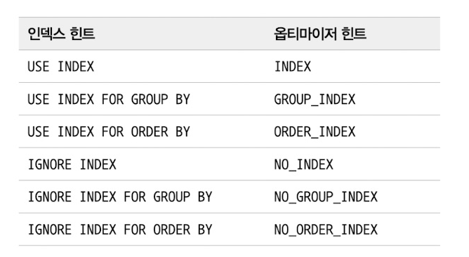

# Ch9 옵티마이저와 힌트
### 쿼리 실행 절차
* 파싱
* 최적화 및 실행 계획 수립
* 수행

### 기본 데이터 처리
* 풀 테이블 스캔
    * 테이블의 레코드 건수가 적어서 인덱스를 사용하는 것보다 빠를 경우
    * Where 절에 인덱스 이용 조건이 없을 경우
    * 인덱스 레인지 스캔을 할 수 있어도 조건 일치 레코드가 너무 많은 경우
* InnoDB의 리드어헤드(1페이지씩 읽지 않고 예상해서 미리 더 읽어오기)
    * 백그라운드 스레드가 수행
    * 풀 인덱스 스캔, 풀 테이블 스캔 등에서 연속된 페이지를 읽을 때 동작
* 병렬 처리
    * innodb_parallel_read_threads 옵션으로만 읽기 스레드 수 조절 가능
* ORDER BY
    * 데이터 레코드 수가 적으면 Filesort
    * 아니면 index 사용
    * 모두 index를 사용하도록 튜닝은 불가능
    * 소트 버퍼
        * 정렬을 할 때 임시 버퍼를 사용
        * 정렬해야 할 데이터가 버퍼보다 크면 멀티 머지
        * 글로벌 메모리가 아닌 세션 별 메모리를 사용
        * 56KB ~ 1MB 사이가 적당
    * 정렬 알고리즘
        * 싱글 패스
            * 모든 튜플을 가져와서 정렬
        * 투 패스
            * 정렬 조건이랑 PK만 가져와서 정렬
        * 레코드 수가 적으면 싱글 패스가 빠름
    * 정렬 처리 방법 속도
        * Index -> FileSort -> Temporary, FileSort 순으로 느림
        * 조인의 드라이빙 테이블 정렬
        * 임시 테이블 사용 정렬
        * LIMIT을 걸어도 정렬이 있으면 모든 튜플을 조회해야 함
    * 쿼리 처리 방법
        * 스트리밍 방식
            * 조건에 일치하는 데이터를 바로 줄 수 있는 경우
        * 버퍼링 방식
            * 모든 데이터를 가공(정렬)해야 하는 경우
            * JDBC는 전체 시간이 짧기 때문에 버퍼링 방식 채택
    * GROUP BY
        * 인덱스 사용
            * 인덱스를 읽으면서 조인
            * 그룹 함수를 쓰는 경우 임시 테이블이 필요할 수 있음
        * 루스 인덱스 사용
            * Prefix 인덱스에서는 사용 불가능
            * 인덱스의 카디널리티가 낮을 수록 효율적
        * 임시 테이블 사용
            * GROUP BY 절의 칼럼들을 UNIQUE로 만든 임시 테이블 생성(Using Temporary)
            * ORDER BY도 같이 쓴다면 정렬도 수행
        * MySQL8.0부터는 인덱스 스킵 스캔 도입(필요한 칼럼에 대해서 자동으로 추가 쿼리 생성)
    * DISTINCT
        * DISTINCT문을 SELECT 뒤에 쓰면 결과 전체 조합이 UNIQUE한 것을 가져옴
            * 집합 함수 내에서 쓰면 해당 컬럼들만 UNIQUE
        * DISTINCT를 처리하기 위해 UNIQUE 임시 테이블 생성
            * 실행 계획에서 Using Temporary를 보여주진 않음
    * 임시 테이블은 메모리에 상주하지만 커지면 디스크로 옮김
        * 임시 테이블은 쿼리 처리를 위해서만 쓰이므로 사용할 수 없음
        * 임시 테이블은 TempTable 엔진 사용, 디스크로 옮기면 InnoDB 엔진 사용

### 고급 최적화
  * 통계 정보 + 옵티마이저 옵션을 결합해서 실행 계획 수립
  * 조인 관련 옵티마이저 옵션, 옵티마이저 스위치 옵션으로 구분
  * 스위치는 글로벌, 세션 별로 설정 가능(On, Off, Default)
  * Nested Loop Join
      * 드라이빙 테이블의 튜플 1건 읽기 -> 드리븐 테이블 조인
      * 조인 처리는 MySQL 엔진, 레코드 가져오기는 스토리지 엔진이 처리
      * 건 별로 드라이빙 테이블의 튜플을 가져오면 스토리지 엔진은 최적화가 불가능
  * MRR(Multi Range Read)
      * 조인 버퍼에 드라이빙 테이블의 튜플들을 가져오고 가득차면 한 번에 요청
      * 응용 방식으로 BKA가 있음(default OFF)
  * Block Nested Loop
      * 조인의 연결 조건에 있는 칼럼이 인덱싱 돼있을 때는 Nested Loop Join
          * 조건 절에 부합하는 튜플이 나오면 바로 조인 이후 리턴
      * 조인용으로 별도의 버퍼가 사용되면 Block Nested
      * 옵티마이저가 풀 테이블 스캔, 풀 인덱스 스캔을 피할 수 없다면 버퍼 생성
      * 조건 절에 부합하는 튜플을 버퍼링해서 드리븐 테이블의 접근 횟수를 줄일 수 있음
      * 조인 버퍼가 사용되는 쿼리에서는 정렬 순서가 흐트러질 수 있음
          * 드라이빙 테이블의 결과를 조인 버퍼에 놔두고 드리븐 테이블의 결과를 조인해서 내보내므로 드리븐 테이블의 순서
  * 인덱스 컨디션 푸시 다운
      * 인덱스 컨디션 푸시 다운이 없을 때
          * Where 절의 인덱스 사용 불가능 조건이면 MySQL 엔진이 조건 비교
          * 인덱스의 칼럼에 포함된 Where 조건이여도 엔진이 비교
      * 인덱스 컨디션 푸시 다운이 있을 때
          * 인덱스의 칼럼에 포함된 Where 조건이면 스토리지 엔진이 비교(Using index condition)
  *  인덱스 확장
      * 세컨더리 인덱스 생성 시 기본 키도 같이 조회 때 사용
          * (A)로 만들면 (A, PK)로 인덱스 생성
  *  인덱스 머지
      * Where 절의 조건이 서로 다른 인덱스를 쓸 수 있을 때 merge 계획 실행
      * intersection
          * 여러 인덱스를 가져와서 교집합 구하기
          * PK는 어차피 인덱스 확장이 되므로, 머지 기능을 끄고 단일 인덱스를 쓰는 것이 나을 수도 있음
      * union
          * OR 연산의 조건일 때 각각의 인덱스로 가져와서 합칩합 구하기
          * PK가 존재하기 때문에 중복처리 가능
          * ::AND 연산의 실행은 하나라도 인덱스를 쓸 수 있으면 인덱스 레인지 스캔 가능::
          * ::OR 연산은 둘다 인덱스를 쓰지 못하면 풀 테이블 스캔::
      * sort_union
          * 합집합에서 둘이 같은 칼럼을 기준으로 정렬되지 않을 때 강제로 정렬해서 중복을 제거
  * 세미 조인
      * IN, = 등의 세미 조인
          * 세미 조인 최적화
          * IN TO EXISTS 최적화
          * MATERIALIZATION 최적화
      * <>, NOT IN 등의 안티 세미 조인
          * IN TO EXISTS 최적화
          * MATERIALIZATION 최적화
      * 테이블 풀 아웃
          * 서브 쿼리를 조인으로 변경
              * 아우터 쿼리로 끄집어냄
          * 세미 조인 서브 쿼리에서만 가능
      * 퍼스트 매치
          * EXISTS 쿼리로 변경해서 첫 번째 튜플 바로 리턴
      * 루스 스캔
          * 루스 인덱스 스캔으로 서브 쿼리를 읽고 아우터 테이블을 드리븐으로 조인
      * 구체화(Materialization)
          * 서브 쿼리를 임시 테이블로 만들어서 드라이빙 테이블과 조인
      * 중복 제거(Duplicated Weed Out)
          * 세미 조인 서브 쿼리를 이너 조인 쿼리로 만들어서 중복 제거
      * 컨디션 팬 아웃
          * 여러 테이블이 조인되는 경우 가능하다면 레코드의 수가 적은 테이블부터 조회
          * 레인지 옵티마이저, 히스토그램, 인덱스 통계, 추측 등을 통해서 레코드 수를 예측
      *  파생 테이블 머지
          * FROM 절의 서브 쿼리는 임시 테이블 사용
          * 여기에 외부 조건도 같이 사용
          * 가능하다면 서브 쿼리는 외부 쿼리로 수동 병합이 빠름 
      *  인비저블 인덱스
          * 존재하는 인덱스도 사용하지 않도록 할 수 있음
      * 스킵 스캔
          * 조건절에 존재하지 않는 선행 인덱스 칼럼들로 쿼리 생성
              * 힌트 옵션으로 스킵 스캔을 쓰도록 쿼리를 짤 수 있음
      * 해시 조인
          * 해시 조인은 시작 레코드 찾기는 느리지만 종료는 빠름(전체 Throughput이 적음)
          * 응답 속도 VS 스루풋 중 중점을 둔 쪽으로 사용
          * Nested Loop보다 항상 좋은 것이 아님
          * 전체 레코드가 적은 테이블로 해시 테이블 생성
          * 해시 테이블이 조인 버퍼 메모리보다 큰 경우 청크로 분리해서 실행
      * 	인덱스 정렬 선호
          * 인덱스를 사용한 실행 계획, 테이블 풀 스캔 중에서 옵티마이저가 테이블 풀 스캔을 잘못 선택하는 경우 prefer_ordering_index 옵션을 false로 하면 됨
          * Order By에 인덱스를 사용할 수 있을 경우 높은 가중치를 부여하기 때문
  * 조인 최적화 알고리즘
      * Exhaustive
          * 옛날에 쓰이던 방식
      * Greedy
          * optimizer_prune_level, optimizer_search_depth 옵션으로 조절
          * 실무적으로 조정은 필요 없음
### 쿼리 힌트
* 인덱스 힌트
  * 인덱스 힌트보다는 옵티마이저 힌트를 사용하는 것이 ANSI-SQL 표준 준수
  * Straight Join
      * 드라이빙 테이블 순서를 바꾸지 못하도록 하는 힌트
  * Use Index
      * 인덱스를 사용하도록 하는 힌트
      * 대부분 잘 선택하므로 괜찮지만 3, 4개 이상의 칼럼을 포함하는 여러 인덱스가 있을 때는 가끔 실수함
  * SQL Calc Found Rows
      * LIMIT에 도달해도 끝까지 검색함
      * FOUND_ROWS() 함수로 전체 몇 건인지도 검색 가능
      * 페이징을 위해서는 COUNT를 쓰는 것이 훨씬 좋음
* 옵티마이저 힌트
    * Max Execution Time
        * 옵티마이저 힌트 중 유일하게 쿼리 실행 계획에 영향을 미치지 않음
        * 쿼리 최대 시간 정하는 용도
    * SET VAR
        * 실행 계획을 바꿀 수도 있고 버퍼의 크기도 임시적으로 바꿀 수 있음
    * Semi Join & No Semi Join
        * Table Pull Out 최적화 전략을 제외한 나머지는 사용 가능
        * 세미 조인의 실행 전략 제어 용도
    * Subquery
        * In To Exists, Materialization 등의 서브 쿼리 최적화 사용 가능
        * 세미 조인 최적화가 불가능 할 때 서브 쿼리 최적화를 사용
        * 사용할 기회가 적음
    * BNL & NO BNL
        * Block Nested Loop 조인을 사용하도록 유도하거나 Hash 조인을 사용하도록 유도
    * Join Fixed Order & Join Order & Join Prefix & Join Suffix
        * Straight Join을 사용하면 일부 순서만 조정이 불가
        * 힌트에 명시된 순서, 드라이빙 테이블만, 드리븐 테이블만 등의 부분적 순서 조정 가능
    * Merge & No Merge
        * MySQL 8은 가능하면 임시 테이블을 사용하지 않도록 함
        * 이때 임시 테이블을 사용할 수도 외부 조건 병합을 할 수도 있음
    * Index Merge & No Index Merge
        * 한 인덱스만 쓸 지 여러 인덱스를 쓸 지
    * No ICP(Index Condition Push Down)
        * ICP를 쓸 지 안 쓸지
        * 대부분의 경우는 쓰는 쪽의 인덱스 사용하지만 느릴 수 있음
    * Skip Scan & No Skip Scan
        * 인덱스의 선행 칼럼의 카디널리티가 높으면 스킵 스캔을 안 하는 것이 효율적일 수 있음
    * Index & No Index
        * 인덱스 힌트를 대체하는 용도
        * 
