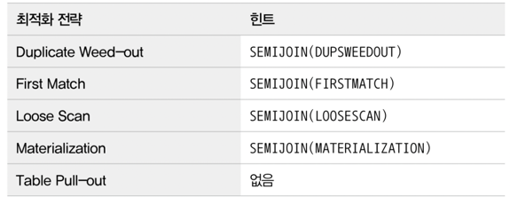
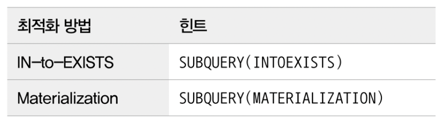
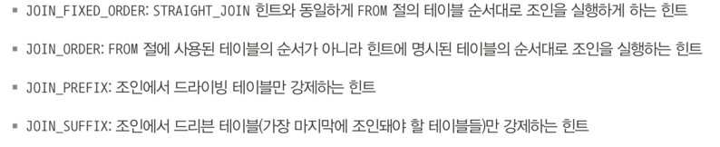
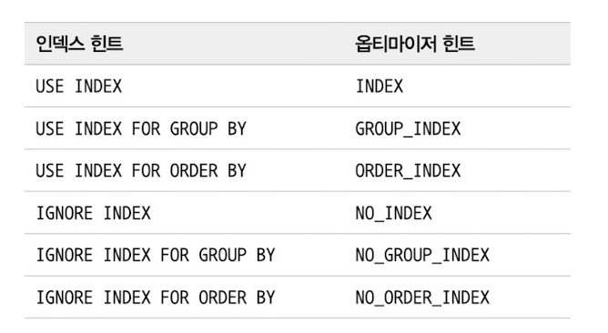

~
# 9.3 고급 최적화

최적화 실행 계획 = 통계 + 옵션

통계 : 알아서 계산

옵션 :
- 1 조인 관련
- 2 스위치 관련
  - 서버의 고급 최적화를 끌지 말지를 결정하는 속성들

## 9.3.1 옵티마이저 스위치 옵션

대부분 default 값으로 켜져있는 상태 

옵션을 제어할 수 있는 단위는 다음과 같다.

- 서버 전체 레벨에서 설정
- 커넥션 단위로 결정
- 쿼리 단위로 결정

### 9.3.1.1 MRR(DS-MRR)과 배치 키 액세스

## --- MY SQL 메모리 영역 ----

- 캐쉬 
    - 디스크로 부터 읽어왔던 인덱스, 데이터 적재되어 있음

- 버퍼 
   - 메모리 상의 임시 공간

---
###  ↕️ 스토리지 엔진(핸들러 통해서 읽기, 쓰기) 
## --- Disk 영역 ---
- 인덱스
- 데이터 페이지
----

최적화
- 드라이빙 테이블 결정
  - 인덱스 있으면 index 사용 , 없으면 file Sort
- 각각의 레코드를 버퍼에 저장
  - 한번에 배치로 쿼리
    - 버퍼 풀에 있으면 버퍼 풀에서 가져옴
    - 없으면 디스크에서 가져옴

응용 버전인 BKA 조인 쿼리 있으나 성능에 안 좋은 영향이 있을 수 있기 때문에 off 되어 있용

### 9.3.1.2 블록 네스티드 루프 조인

네스티드 루프 조인
- 조인 연결 조건이 되는 칼럼이 모두 인덱스에 있을 때 사용 ( 대부분을 차지함 )
- 인덱스에서 읽은 후 join 을 실행하여 결과 즉시 반환

블록 네스티드 루프 조인
- "Using Join Buffer" 문구가 뜬다면 블록 네스티드 루프 조인이 사용된 것임.
- 네스티드 루프 조인과 크게 두 가지 차이점이 존재한다.
  - 조인 버퍼
  - 드라이빙 테이블스
    - 기본적으로는 select 건 순서대로 드라이빙, 드리븐 테이블이 결정된다. ( 두 테이블의 정보를 인덱스에서 가져올 수 있다면 )
    - 드라이빙 테이블은 한번에 쭉 읽지만 드리븐 인덱스가 없어서 풀테이블 스캔을 하고 여러번 호출된다.
      - 드라이빙 테이블를 먼저 읽어서 조인 버퍼에 저장한다.
      - 드리븐 테이블에서 필요한 컬럼를 딱 한번만에 다 가져온다.
        - 이렇게 구성하면 조인 버퍼에는 조인할 대상 테이블 컬럼들만 걸러서 모여진 상태이다.
        - 이 상태에서 조인을 실행한다.
      - 결국 유효한 데이터를 선별해서 잠시 저장할 곳이 필요해서 조인 버퍼가 쓰이는 것이다.
      - 그 후 정제된 데이터 간의 조인을 실행하는데 이때 드라이빙 테이블이 바뀔 수 있다.

#### 9.3.1.3 인덱스 컨디션 푸시다운
- Where 과 같은 조건들을 Mysql 에서 처리될 수 도 있고 InnoDB 에서도 처리될 수도 있다.
  - 조인 버퍼, 소트 버퍼같은 것들을 생각하면 되는데 이런 버퍼들에 데이터들을 가져오는 것은 InnoDB의 조건 검색 역할이지만 조건 검사는 MySql 엔진의 역할이다.
- MySql 5.5 이하 버전에서는 인덱스 범위 제한 조건으로 사용하지 못하는 조건들을 보내지 않아서 InnoDB 는 비교적 적은 조건으로 비교하였다.
  - 그로 인해서 MySql 이 굳이 담당하는 조건 비교 역할이 증가되었고 이는 비효율을 발생시킨다.
    - 실행 계획 'Using where' 출력
  - 하지만 index_condition_pushdown 를 사용하지면 인덱스에 포함된 칼럼에 대한 정보를 InnoDB에 다 전달하여 최적화가 일어난다.
    - 실행계획 'Using index condition' 출력

#### 9.3.1.4 인덱스 확장
 - 세컨더리 인덱스에 프라이머리 인덱스 키를 사용할지 결정할 수 있음
   - InnoDB 에서 세컨더리 인덱스의 루프 노드에는 프라이머리 키 값을 가진다.
   - 이렇게 가지고 있는 프라이머리 키 값을 사용할지 말지 결정하는 옵션으로 'use_index_extentsion' 가 있다.

### 9.3.1.5 인덱스 머지
- 대부분의 옵티마이저는 인덱스를 활용한 쿼리에서 하나의 인덱스만 사용한다.
  - 조건이 다양하면 읽어온 인덱스로 레코드를 읽어온 후 나머지 조건은 레코드에 대해서 체크하는 형태로만 사용한다  
    - 인덱스 컨디션 푸시다운에서 조건이 엔진 혹인 인덱스 두 군데서 판단되는 것이랑 연관해서 생각
- 하지만 조건을 만족하는 레코드 건수가 많고 다른 인덱스를 함께 사용할 수 있을 것 같다면 인덱스 머지를 실행함
  - 이 머지 전략은 총 세가지가 존재함
    - 교집합(index_merge_intersection)
    - 합집합(index_merge_union)
    - 정렬 후 합집합(index_merge_sort_union)

### 9.3.1.6 교집합
- 두 가지 컬럼에 대한 조건을 가진 쿼리에서 각각의 컬럼에 인덱스가 있을 때 발생할 수 있다.
  - 만약 두 가지 인덱스 중 둘 중 하나의 인덱스로만 가져오는 레코드가 너무 많다면 발생한다
- 두 인덱스에서 조건에 해당되는 결과를 가져온다
  - 모든 인덱스는 프라이머리 키가 있으니 두 인덱스 결과의 프라이머리 키를 비교하여 같은 것만 골라서 반환한다.
- 모든 인덱스는 앞서 말했듯 프라이머리 키를 가지고 있는데 만약 두 조건 중 하나가 프라이머리 키에대한 조건 이었다면 굳이 이런 교집합을 구할 필요가 없다.
  - 그럴 경우에는 이 옵션을 끄면되는데 이건 특수한 경우일 수 있으니 보통 쿼리 단위로 끌수도 있다.

### 9.3.1.7 합집합
- 인덱스 반환 결과가 프라이머리 키로 정렬되어있을 경우에 사용된다. 
  - 세컨더리 인덱스는 앞서 말했듯 (secondary_index_column, primary index) 로 생성 되기 때문에 하나의 secondary_index 에 대한 프라이머리 키는 정렬되어있다.
  - 그래서 where name = 'Pooh' 같은 세컨더리 인덱스 결과는 프라이머리 키로 정렬되어있지만 where name = BETWEEN ~ and ~ 같은 쿼리는 불가능
- OR 연산 같은 결과 값을 반환할 때 합집합을 각 인덱스 결과를 합하여 반환한다. 
  - 이때 중복되는 컬럼들은 우선순위 큐를 사용해서 제거한다.

### 9.3.1.8 정렬 후 합집합
- 세컨더리 인덱스 반환 결과가 프라이머리 키로 정렬되어 반환되지 않을 경우에 사용된다.
  - 우선순위 큐를 사용해서 중복제거는 정렬된 프라이머리 키 값으로 진행된다.
  - 그래서 세컨더리 인덱스 반환 값들의 프라이머리 키들을 정렬한 후 중복제거하여 반환한다.

### 9.1.3.9 세미 조인
- 서브 쿼리에서 적용할 수 있는 최적화는 다음과 같다.
  - "IN" or "=" subquery
    - 세미 조인 최적화
      - Table Pull-out
      - Duplication Weed-out
      - First Match
      - Loose Scan
      - Materialization
    - IN-to_EXISTS 최적화
    - MATERIALIZATION 최적화
  - "<>" or "NOT IN" subquery
    - IN-to_EXISTS 최적화
    - MATERIALIZATION 최적화

### 9.3.1.10 테이블 풀-아웃
- 서브 쿼리를 Join 쿼리로 바꿔서 실행한다.
  - 세미 조인 서브쿼리에서만 사용가능
  - Unique index 혹은 프라이머리 키를 찾아서 결과가 한 건인 경우에만 사용가능
  - 서브쿼리의 모든 테이블들이 아우터 쿼리로 끄집어 낼 수 있다면 서브 쿼리 자체가 없어짐

### 9.3.1.11 퍼스트 매치
- in 연산을 exist 와 같은 연산으로 바꿔서 처리하는 방식이다.
  - 먼저 아우터 테이블의 결과를 모두 얻는다.
  - 아우터 테이블의 결과에 대해서 만족하는 조건 검사를 first match 방식으로 처리한다.
    - 조건에 만족하면 더 이상 읽지 않고 해당 아우터 테이블의 컬럼 값이 결과 값으로 반환된다.

장점
- 최적화를 위해서 동등 조건 같은 것을 임의로 추가하기도 하는데 기존에는 서브 쿼리 내에서만 가능했던 반면 이제는 아우터 쿼리에도 추가 가능하다.
  - 좀 더 최적화된 쿼리 작성 가능
- 적용 여부 결정 가능

제한 사항 및 특성
- 먼저 아우터 테이블 결과부터 찾음
- 최적화가 사용되었다면 FirstMatch 라고 뜬다.
- 상관 서브쿼리에서도 사용가능
  - 상관 서브쿼리란 서브 쿼리 내에서 아우터 쿼리와의 연관성을 가지는 쿼리다. 
    - ex) 아우터 테이블이 t1 이었을 때 서브 쿼리가 select * from t2 where **"t1.id"** = t2.pid 에서 서브 쿼리에 아우터 쿼리 테이블인 t1 이 포함된 경우이다.

### 9.3.1.12 루스 스캔
- 만약 in 조건에 루스 인덱스 스캔이 가능하다면 적용 가능하다.
- 유니크한 그룹을 식별한 후 데이터는 조인해서 가져온다.

### 9.3.1.13 구체화
- 퍼스트 매치는 아우터 테이블이 일부분으로 축소되는 상황일 때 유용하다.
- 만약 아우터 테이블의 컬럼이 모든 테이블의 칼럼을 다읽어야 한다면 서브 쿼리를 구체화한다.
  - 서브 쿼리 결과를 임시 테이블에 먼저 저장한 후 아우터 테이블의 데이터를 가져온다

제한 사항 및 특성
- 상관 서브쿼리가 아니여야 한다.
- Group By 같은 집합 함수들이 사용가능하다.
- 구체화의 경우 임시 테이블이 사용된다.

### 9.3.1.14 중복제거
- 세미 조인 서브쿼리를 일반적인 inner join 으로 변경해서 실행한다.
  - 실제 조인을 실행한 후 중복을 제거하기 떄문에 group by 문을 사용한 것과 같다.

제약 사항 및 특성
- 서브쿼리가 상관 서브쿼리라도 사용할  수 있다.
- 서브쿼리가 group by나 집합 함수가 사용된 경우는 사용 불가능하다.
  - 서브 쿼리의 결과에 대한 임시 테이블은 아마 생성 못하는 듯 ? ( 추측 )
- 서브쿼리의 테이블을 조인으로 처리하기 때문에 최적화 할 수 있는 방법이 많다.

### 9.3.1.15 컨디션 팬아웃
- 조인을 실행할 때 테이블의 순서는 큰 영향을 미친다.
  - 두 테이블에서 매칭되는 레코드가 작은 테이블을 드라이빙 테이블로 잡아야 조인 쿼리가 적게 나간다.
    - 그럼 이 매칭되는 레코드가 작다는 것을 판단할 수 있어야 하는데 이 때 condition_fanout_filter 를 사용한다면 조금 더 정밀하게 매칭될 레코드 수치를 알 수 있다.
- condition_fanout_filter 을 킨다면 다음과 같은 테이블 레코드에 대한 칼럼 예측값을 얻을 수 있다.
  - Where 조건절에 사용된 칼럼에 대해 인덱스가 있는 경우
  - Where 조건절에 사용된 칼럼에 대해 히스토그램이 존재하는 경 ( 히스토그램은 컬럼에 대한 분포도를 알 수 있는 데이터다 )
- 레코드를 예측하는 방법의 우선순위는 다음과 같다.
  - 1. 레인지 옵티마이저 사용 : 소량의 데이터만 읽어보는 방식으로 인덱스가 있을 때 사용 가능.
  - 2. 히스토그램을 이용한 예측
  - 3. 인덱스 통계를 이용한 예측
  - 4. 추측에 기반한 예측

제약 사항

이런 에측도 결국 컴퓨팅 자원을 써서 하는 것이기 때문에 무조건 적으로 도입을 고려할 필요는 없고 자기 시스템의 쿼리문을 분석해서 적용해야한다.

### 9.3.1.16 파생 테이블 머지
- 예전 버전의 MySQL 서버는 from 절의 서브 쿼리를 파생 테이블(Derived Table)을 통해서 처리했다.
  - 데이터가 작다면 메모리에 상주시키겠지만 커지면 디스크에 쓰면서 시간 비용이 상당히 많이 든다.
    - 기존 Memory 스토리지 엔진에서 TempTable 로 바뀜에 따라서 가변 길이 칼럼을 지원받아 성능이 개선되었지만 그래도 성능이 나쁘다.

- 하지만 derived_merge 는 서브 쿼리를 외부 쿼리에 병합시켜서 이런 임시 테이블을 통한 서브쿼리 처리를 제거한다.

제약사항
- 모든 상황에서 서브 쿼리를 외부 쿼리에 병합시킬 수 있는 것은 아니다.
- 이런 조건은 여럿있는데 자세한 내용은 RealMySql p.353 를 참고하자.

### 9.3.1.17 인비저블 인덱스
- 인덱스는 가용 상태를 지정할 수 있다.
- 가용 상태가 꺼져 있는 인덱스는 기본적으로 볼 수 없는데 옵션을 통해 이런 인덱스 까지 볼 수 있도록 만들 수 있다.

### 9.3.1.18 스킵 스캔
- 인덱스는 지정된 칼럼 순서대로 정렬되어 있다.
- 스킵 스캔을 사용할려면 인덱스의 최우선 정렬 컬럼이 명시되어야 사용가능했다.
- 하지만 이부분이 최적화 되어서 후행 컬럼으로만 검색된 컬럼이여도 최우선 컬럼들을 임시로 만들어 주어서 마치 최우선 컬럼이 포함된 쿼리처럼 실행한다.
  - 이때 최우선 컬럼의 유니크 컬럼 갯수만큼 쿼리를 생성하기 때문에 최우선 컬럼이 적을 때만 사용하는 방법이다.

### 9.3.1.19 해시 조인
- 네스티드 루프 조인은 첫 번째 컬럼을 빨리 찾고 스루폿이 길다.
- 해시 조인은 첫 번째 컬럼을 늦게 찾고 스루풋이 길다.
- 그래서 왠만한 작은 데이터들을 그냥 네스티드로 빨리 찾고 금방 끝내는 것이 빠르다.
  - 만약 스루풋이 중요한 분석 작업은 해시 조인을 사용하는 것이 맞겠지만 mysql 같은 범용 rdbms 은 처리 속도가 더 중요하기 떄문에 네스티드가 더 자주 쓰인다.
- 네스티드가 너무 오래 걸릴 것 같으면 과거에는 블록 네스티드 루프 조인을 썼지만 현재는 해시 조인을 쓴다.
  - 해시 조인은 인덱스가 없거나 조인 대상 테이블의 일부의 레코드 건수가 매우 적은 경우에만 작동한다.
- 해시 조인은 두 가지 단계가 있다.
  - 빌드 단계
    - 테이블 중 컬럼이 적어서 해시 테이블로 만들기 용이한 테이블을 해시 테이블로 만드는 과정
  - 프로브 단계
    - 나머지 테이블을 읽어서 일치 레코드를 찾는 과정을 말한다.
- 조인 버퍼의 공간이 한정되어 있기 때문에 해시 테이블을 통한 조인 버퍼는 크게 두 가지로 분리할 수 있다.
  - 조인 버퍼 공간이 충분할 경우
    - 메모리에서 바로 연산되어서 반환된다.
  - 조인 버퍼 공간이 부족할 경우
    - 청크 단위로 나눠서 디스크에 저장한 후 결과를 반환한다.

### 9.3.1.20 인덱스 정렬 신호
- 가끔 mysql 옵티마이저가 ORDER BY의 정렬 과정을 없애기 위해서 비효율적인 인덱스를 통해 데이터를 읽을 때가 있다.
- 이런 경우가 너무 많이 발생하면 prefer_ordering_index 옵션을 꺼서 조금 더 최적화된 index 통해서 쿼리가 처리되도록 유도한다.

## 9.3.2 조인 최적화 알고리즘
- 조인 쿼리 실행 계획 최적화 알고리즘은 크게 2가지가 있다.
  - Exhaustive 알고리즘
    - 모든 테이블 조합을 계산해서 최적 알고리즘 계획을 세우는 법 팩토리얼 경우의 수를 계산하기 때문에 상당히 오래걸릴 수 있다.
    - 5.0 이전 버전의 알고리즘
  - Greedy 검색 알고리즘
    - 시스템 변수로 설정된 dept 만큼의 경우의 수만으로 우선적으로 최적을 비교
      - 최적 계획의 첫 번째 요소를 조인 순서의 첫 번쨰 요소로 선택
    - 첫 번째 요소를 결정하고 그 다음 새로운 dept 2를 생성하여 최적 경우 비교
      - 최적 계획의 두 번째 요소를 조인 순서의 두 번째 요소를 선택
    - 중요한 옵션으로 optimizer_searh_depth 와 optimizer_prune_level 이 있음
      - optimizer_search_depth : Greedy 알고리즘과 Exhaustive 알고리즘의 사용에 대한 분기점이 결정되는 값 기본 62로 되어있고 62개의 테이블 보다 적으면 Exhaustive 만 사용된다.
      - optimizer_prune_level : 테이블 실행 계획 수립 중 최적화를 사용할 것인가에 대한 옵션 해당 옵션을 항상 1로 유지할 것
      - 많은 최적화가 있었기에 optimizer_prune_level 만 1로 켜줘도 Exhaustive 알고리즘으로 0.1초 안에 계획 수립이 가능하다.

# 9.4 쿼리 힌트
최적화가 많이 진행됬지만 서비스에 따라서 최선의 최적화가 아닐 가능성이 있음
그래서 DBA 혹은 서버 개발자가 DB에 명시적으로 힌트를 줄 수 있는데 줄 수 있는 힌트는 크게 두 가지가 있다.
1. 인덱스 힌트
2. 옵티마이저 힌트

## 9.4.1 인덱스 힌트
인덱스 힌트들은 옵티마이저 힌트가 도입되기 전에 사용하던 것으로 ANSI_SQL 표준 문법을 준수하지 못한다.

그래도 왠만하면 옵티마이저 힌트를 쓰는 것을 사용한다.

또한 인덱스 힌트는 select 와 update 명령에서만 사용 가능하다.

### 9.4.1.1 Straight_join
보통 옵티마이저가 조인 순서를 결정한다.

이때 옵티마이저에게 조인 순서를 순서대로 수행하도록 유도할 수 있다.

이것은 옵티마이저가 좋은 조인 순서를 제대로 못 찾아낼 때만 사용하는 것이 좋은데 좋은 조인 순서란 다음과 같다.

1. 임시 테이블과 일반 테이블의 조인 : 임시 테이블을 드라이빙 테이블로 사용하도록 유도
2. 임시 테이블 끼리 조인 : 작은 테이블을 드라이빙으로 선택
3. 일반 테이블끼리 조인 : 둘다 인덱스가 없거나 있을 경우 레코드가 작은 것을, 이외의 경우에는 조인 칼럼에 인덱스가 없는 테이블을 드라이빙으로 선택하는 것이 좋음

이 외에도 (JOIN FIXED ORDER, JOIN ORDER, JOIN PREFIX, JOIN SUFFIX) 옵션들이 비슷한 역할을 한다.

### 9.4.1.2 USE INDEX / FORCE INDEX / IGNORE INDEX
조인의 순서를 변경하는 것 다음으로 자주 사용되는 것이 인덱스 힌트이다.
인덱스를 적절히 찾아내지 못할 때 사용할 수 있다.

인덱스 힌트의 종류는 크게 3가지가 있다.
1. use index : 사용하도록 권고
2. force index : 사용하도록 강제
3. ignore index : 사용하지 못하도록

또 이 명령어 들의 용도를 지정해줄 수 있다.

1. use index for join : 조인과 검색을 포함하는 범위
2. use index for order by : order by 를 위해서 사용
3. use index for group by : group by 를 위해서 사용
용도는 보통 옵티마이저가 잘 알아서 선택해준다.

### 9.4.1.3 SQL_CALC_FOUND_ROWS
LIMIT 조건을 걸었을 때 해당 갯수만큼의 레코드가 반환되면 즉각 검색 작업을 멈춘다.

하지만 해당 옵션이 켜져 있다면 끝까지 검색을 수행한다.

페이징 같은 것을 해당 옵션으로 수행하는 경우가 있는데 count 와 조합하여 페이징 하는 것이 훨씬 더 효율적이다.

성능적 향상이 아니라 개발자의 편의를 위해 만들어진 것으로 왠만하면 사용하지 않는 것을 권장

## 9.4.2.1 옵티마이저 힌트 종류
1. 인덱스 : 특정 인덱스의 이름 특정 -> 반드시 테이블명이 선행되어야한다.
2. 테이블 : 특정 테이블의 이름 특정
3. 쿼리 블록 : 어떤 쿼리에 대해서 미리 등록해두는 것이 아닌 쿼리 작성시 힌트를 그때마다 작성해줘야함
   - 서브 쿼리에서 사용한 최적화 옵션을 QB_NAME 으로 네이밍하고 외부 쿼리 블록에서 사용할 수 있음.
4. 글로벌 : 전체 쿼리에 대해서 영향을 미치는 쿼리

### 9.4.2.2 MAX_EXECUTION_TIME
- 옵티마이저 힌트 중에 유일하게 실행 계획에 영향을 안 미치는 경우
- 쿼리의 최대 실행 시간 설정하는 힌트임.

### 9.4.2.3 SET_VAR
- 실행 계획은 시스템 변수에 상당한 영향을 많이 받는다
  - 예를 들어 조인 버퍼의 크기에 따라 조인 버퍼의 사용여부가 실행 계획에서 달라진다.
- SET_VAR 는 한 쿼리에서 이런 시스템 변수를 바꿔서 명령을 내릴 수 있도록 한다.
  - 다만 모든 시스템 변수를 바꿀 수 있는 것은 아니다.

### 9.4.2.4 SEMIJOIN & NO_SEMIJOIN
세미 조인의 전략을 선택할 수 있다.

Table pull-out 의 사용은 항상 더 나은 성능을 보장하기 때문에 제공하지 않는다.

다른 전략은 우회로 인한 성능 향상을 기대할 수 있기 때문에 존재한다.

### 9.4.2.5 SUBQUERY
세미 조인 최적화가 사용될 수 없을 때 사용하는 최적화이다.

안티 세미 조인의 경우에는 세미 조인 최적화가 불가능 하기 때문에 해당 최적화 옵션만 사용가능하다.

사용 빈도가 적기 때문에 자세한 내용은 서브쿼리 최적화 메뉴얼을 찾아보자.

### 9.4.2.6 BNL & NO_BNL & HASHJOIN & NO_HASHJOIN
- 8.0.20 이후로는 해쉬조인만 사용하기 때문에 BNL, NO_BNL 이 결국 해쉬 조인 유도 옵션으로 바꼈음
- 그전 버전인 8.0.18 버전 에서는 HASHJOIN, NO_HASHJOIN 이 유효하긴하다.

### 9.4.2.7 JOIN_FIXED_ORDER & JOIN_ORDER & JOIN_PREFIX & JOIN_SUFFIX
조인 순서를 결정할 수 있는 것으로 전부 혹은 일부를 선택할 수 있다.

### 9.4.2.8 MERGE & NO_MERGE
예전에는 서브쿼리를 항상 임시 테이블을 사용해서 처리했는데 이에 반해

서브 쿼리를 외부 쿼리에 포함하는 것을 머지라한다.

때떄로는 임시테이블을 생성하는 것이 더 나은 선택이 될 수 있는데 이때 사용할 수 있는 옵션이다.

### 9.4.2.9 Index Merge & No Index Merge
인덱스 머지 사용 계획을 킬수도 있고 끌 수도 있다.

### 9.4.2.10 NO_ICP
인덱스 푸시 다운 옵션을 끌 수도 있음

인덱스 푸시 다운 각이 나오면 맹목적으로 해당 인덱스를 골라버리는 경우를 방지하기 위함

### 9.4.2.11 Skip Scan & No Skip Scan
인덱스 스킵 스캔의 선행 칼럼이 없을 때 자동으로 넣어주는 방식으로 최적화 되었었는데

유니크한 값이 적지 않은데도 자꾸 이런 방식으로 처리하면 인덱스 스킵 스캔을 끌 수 있다.

### 9.4.2.12 INDEX & NO_INDEX
인덱스 힌트는 표준을 만족하지 못하고 예전의 것이다.

옵티마이저는 반면에 표준을 만족하도록 나온 최신의 최적화로써 옵티마이저 최적화를 사용할 것을 권장한다.

예전에 사용하던 인덱스 힌트에 해당하는 옵티마이저 힌트는 다음과 같다.

